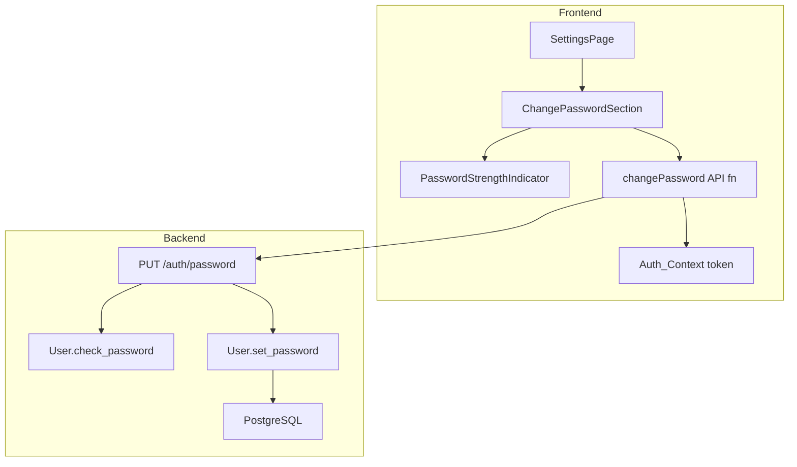

# Design Document: Change Password

## Overview

The Change Password feature adds a third section to the existing Settings page (`/settings`), positioned below the Appearance card. It allows authenticated users to update their account password by:

1. Verifying their current password
2. Entering a new password that meets strength criteria (≥8 chars, uppercase letter, special character)
3. Confirming the new password matches

A real-time **Password Strength Indicator** evaluates the new password against four criteria (length ≥8, uppercase, special character, digit) and displays a color-coded bar with a label (Weak/Fair/Strong).

The backend exposes a new `PUT /auth/password` endpoint that validates the current password, enforces the same strength rules server-side, and hashes the new password with Werkzeug (pbkdf2:sha256) before persisting.

---

## Architecture



### Data Flow — Password Change

1. User fills in Current Password, New Password, Confirm New Password
2. Client-side validation runs on submit (required fields, length ≥8, uppercase, special char, passwords match)
3. If valid, `changePassword(token, { current_password, new_password })` sends `PUT /auth/password`
4. Backend verifies current password against stored hash
5. Backend validates new password strength server-side
6. Backend hashes new password with `generate_password_hash` and updates the database
7. On success (200): frontend shows success message, clears form, hides strength indicator
8. On error: frontend displays appropriate error message (field-level or general)

### Data Flow — Password Strength Indicator

1. User types in the New Password field (any input event: keypress, paste, clear)
2. `PasswordStrengthIndicator` evaluates four criteria: length ≥8, has uppercase, has special char, has digit
3. Score: 0-1 criteria met → Weak (red), 2-3 → Fair (amber), 4 → Strong (green)
4. Bar width fills proportionally (1/3, 2/3, full) with color and label text

---

## Components and Interfaces

### New Files

| File | Purpose |
|------|---------|
| `frontend/src/api/password.ts` | `changePassword()` API function |
| `frontend/src/components/PasswordStrengthIndicator.tsx` | Strength bar + label component |
| `frontend/src/components/PasswordStrengthIndicator.module.css` | Styles for the indicator |
| `backend/routes/auth.py` (modified) | New `PUT /auth/password` route added |
| `frontend/src/pages/SettingsPage.tsx` (modified) | Add ChangePasswordSection below Appearance |
| `frontend/src/pages/SettingsPage.module.css` (modified) | Add styles for strength indicator and password section |

### Password API Function

```typescript
// frontend/src/api/password.ts
import { NetworkError } from '../types';

const API_URL = import.meta.env.VITE_API_URL;

export interface ChangePasswordPayload {
  current_password: string;
  new_password: string;
}

export interface ChangePasswordResponse {
  message: string;
}

export async function changePassword(
  token: string,
  payload: ChangePasswordPayload
): Promise<ChangePasswordResponse> {
  let response: Response;
  try {
    const controller = new AbortController();
    const timeoutId = setTimeout(() => controller.abort(), 30000);

    response = await fetch(`${API_URL}/auth/password`, {
      method: 'PUT',
      headers: {
        'Content-Type': 'application/json',
        'Authorization': `Bearer ${token}`,
      },
      body: JSON.stringify(payload),
      signal: controller.signal,
    });

    clearTimeout(timeoutId);
  } catch (err) {
    if (err instanceof TypeError || (err instanceof DOMException && err.name === 'AbortError')) {
      throw new NetworkError('An unexpected error occurred. Please try again.');
    }
    throw err;
  }

  const body = await response.json();

  if (!response.ok) {
    throw { status: response.status, ...body };
  }

  return body;
}
```

### PasswordStrengthIndicator Component

```typescript
// frontend/src/components/PasswordStrengthIndicator.tsx
interface PasswordStrengthIndicatorProps {
  password: string;
}

function PasswordStrengthIndicator({ password }: PasswordStrengthIndicatorProps) {
  // Evaluates 4 criteria:
  // 1. length >= 8
  // 2. at least one uppercase letter
  // 3. at least one special character
  // 4. at least one digit
  //
  // Score 0-1 → Weak (red #EF4444, 33% bar width)
  // Score 2-3 → Fair (amber #F59E0B, 66% bar width)
  // Score 4   → Strong (green #10B981, 100% bar width)
  //
  // Hidden when password is empty (not rendered in DOM)
  // Uses aria-label="Password strength: {level}" and aria-live="polite"
}
```

### Backend Endpoint — PUT /auth/password

Added to `backend/routes/auth.py`:

```python
@auth_bp.route("/password", methods=["PUT"])
@jwt_required()
def change_password():
    """Change the authenticated user's password.

    Request body:
        current_password (str): The user's current password for verification
        new_password (str): The new password to set

    Returns:
        200 + { "message": "Password changed successfully." } on success
        400 + { "errors": {...} } on validation failure
        401 + { "error": "..." } on wrong current password or missing JWT
        500 + { "error": "..." } on database error
    """
    # 1. Get current user from JWT identity
    # 2. Validate required fields (current_password, new_password)
    # 3. Validate new_password strength:
    #    - 8 <= len <= 128
    #    - at least one uppercase letter (A-Z)
    #    - at least one special character
    #    Evaluate in priority order; return first failing rule only
    # 4. Verify current_password against stored hash
    # 5. Hash new password with generate_password_hash (pbkdf2:sha256)
    # 6. Update user.password, commit
    # 7. On DB error: rollback, return 500
```

### ChangePasswordSection (inside SettingsPage)

The section is embedded directly in `SettingsPage.tsx` (not a separate component file), following the same pattern as the existing Profile section. It maintains its own local state:

```typescript
// State for Change Password section
const [currentPassword, setCurrentPassword] = useState('');
const [newPassword, setNewPassword] = useState('');
const [confirmPassword, setConfirmPassword] = useState('');
const [pwFieldErrors, setPwFieldErrors] = useState<PasswordFieldErrors>({});
const [pwGeneralError, setPwGeneralError] = useState('');
const [pwSuccessMessage, setPwSuccessMessage] = useState('');
const [pwLoading, setPwLoading] = useState(false);
```

### Updated SettingsPage Structure

```
SettingsPage
├── Page Title ("Settings")
├── Card: Profile Section (existing)
├── Card: Appearance Section (existing)
└── Card: Change Password Section (NEW)
    ├── Section Title ("Change Password")
    ├── Success message (role="status", conditional)
    ├── General error banner (role="alert", conditional)
    ├── Form (noValidate)
    │   ├── Current Password (type="password", maxLength=128)
    │   ├── New Password (type="password", maxLength=128)
    │   ├── PasswordStrengthIndicator (conditional on non-empty)
    │   ├── Confirm New Password (type="password", maxLength=128)
    │   └── Submit Button ("Update Password" / "Updating...")
    └── Field-level validation errors (per field)
```

---

## Data Models

### Existing User Model (no changes needed)

The `User` model already has `set_password()` and `check_password()` methods that use Werkzeug's password hashing:

```python
class User(db.Model):
    __tablename__ = "users"
    id = db.Column(db.Integer, primary_key=True)
    full_name = db.Column(db.String(255), nullable=False)
    email = db.Column(db.String(254), unique=True, nullable=False, index=True)
    password = db.Column(db.String(512), nullable=False)  # pbkdf2:sha256 hash
    created_at = db.Column(db.DateTime, default=datetime.utcnow, nullable=False)

    def set_password(self, plain_text: str) -> None: ...
    def check_password(self, plain_text: str) -> bool: ...
```

No schema changes are required. The endpoint simply calls `user.check_password(current)` and `user.set_password(new)`.

### Password Validation Rules (shared logic)

Both frontend and backend enforce:
- Minimum length: 8 characters
- Maximum length: 128 characters
- At least one uppercase letter (A-Z)
- At least one special character from: `!@#$%^&*()_+-=[]{}|;:',.<>?/`~"`

Frontend validates on submit (prevents API call if invalid). Backend re-validates as a security measure.

### Password Strength Scoring (frontend only)

Four criteria checked:
1. Length ≥ 8
2. Contains uppercase letter
3. Contains special character
4. Contains digit

| Criteria Met | Level | Color | Bar Width |
|-------------|-------|-------|-----------|
| 0–1 | Weak | #EF4444 (red) | 33% |
| 2–3 | Fair | #F59E0B (amber) | 66% |
| 4 | Strong | #10B981 (green) | 100% |

---

## Correctness Properties

### Property 1: Password change round trip

*For any* valid new password (8–128 chars, at least one uppercase letter, at least one special character), submitting it via PUT /auth/password with the correct current password SHALL result in the new password being stored as a hash, and subsequent authentication with the new password SHALL succeed while authentication with the old password SHALL fail.

**Validates: Requirements 5.1, 5.9**

### Property 2: Client-side validation prevents invalid submissions

*For any* new password that violates at least one of the three rules (length < 8, no uppercase, no special char), submitting the change password form SHALL NOT send a network request and SHALL display a validation error.

**Validates: Requirements 2.1, 2.2, 2.3**

### Property 3: Password strength scoring is deterministic

*For any* given password string, the strength indicator SHALL consistently produce the same level (Weak/Fair/Strong) based on the number of criteria met (0–1 = Weak, 2–3 = Fair, 4 = Strong), regardless of when or how the password is entered.

**Validates: Requirements 3.4, 3.5, 3.6**

### Property 4: Current password verification is mandatory

*For any* request to PUT /auth/password where the current_password does not match the stored hash, the endpoint SHALL return HTTP 401 and SHALL NOT modify the stored password, regardless of whether the new password is valid.

**Validates: Requirements 5.3**

### Property 5: Server-side validation rejects invalid passwords

*For any* new password that fails server-side validation (length, uppercase, special char), the endpoint SHALL return HTTP 400 with the first failing rule and SHALL NOT modify the stored password.

**Validates: Requirements 5.4, 5.5, 5.6, 5.10**

---

## Error Handling

### Backend (PUT /auth/password)

| Scenario | HTTP Status | Response Body |
|----------|-------------|---------------|
| Missing `current_password` | 400 | `{ "errors": { "current_password": "Current password is required." } }` |
| Missing `new_password` | 400 | `{ "errors": { "new_password": "New password is required." } }` |
| New password < 8 chars or > 128 chars | 400 | `{ "error": "Password must be between 8 and 128 characters." }` |
| New password missing uppercase | 400 | `{ "error": "Password must contain at least one uppercase letter." }` |
| New password missing special char | 400 | `{ "error": "Password must contain at least one special character." }` |
| Current password incorrect | 401 | `{ "error": "Current password is incorrect." }` |
| Missing/invalid JWT | 401 | `{ "msg": "..." }` (Flask-JWT-Extended default) |
| Database error | 500 | `{ "error": "An unexpected error occurred. Please try again." }` |
| Success | 200 | `{ "message": "Password changed successfully." }` |

**Validation priority order** (when multiple rules fail, return first in order):
1. Length (8–128)
2. Uppercase letter
3. Special character

### Frontend Error Handling

| Error Type | Display Location | Behavior |
|-----------|-----------------|----------|
| Client-side validation: empty current password | Below Current Password field | `aria-invalid`, `aria-describedby` |
| Client-side validation: new password rules | Below New Password field | First failing rule only (priority order) |
| Client-side validation: passwords don't match | Below Confirm New Password field | `aria-invalid`, `aria-describedby` |
| Server 401 (wrong current password) | Below Current Password field | Maps to field error |
| Server 400 (new password validation) | Below New Password field | Shows server message |
| Network error / 500 / timeout | General error banner above form | Form data preserved |
| Success | Success banner above form (role="status") | All fields cleared, indicator hidden |

### Timeout Handling

- AbortController with 30-second timeout on the fetch request
- On timeout: treated as network error, shows general error message, re-enables button

---

## Testing Strategy

> **Note**: Property-based testing is NOT applicable for this feature. The project's steering files explicitly mandate "unit tests only" for both frontend and backend. This feature involves form validation, API calls, and UI state management — all better served by example-based unit tests.

### Backend Tests (`backend/tests/test_auth.py` — extended)

Test the `PUT /auth/password` endpoint:

| Test Case | Scenario |
|-----------|----------|
| Success — password changed | Valid token, correct current password, valid new password → 200 |
| Missing `current_password` field | → 400 with errors object |
| Missing `new_password` field | → 400 with errors object |
| Missing both fields | → 400 with errors for both |
| New password too short (< 8) | → 400 with length error |
| New password too long (> 128) | → 400 with length error |
| New password missing uppercase | → 400 with uppercase error |
| New password missing special char | → 400 with special character error |
| Multiple validation failures (returns first) | → 400 with first failing rule |
| Current password incorrect | → 401 with "Current password is incorrect." |
| No JWT token | → 401 unauthorized |
| Invalid JWT token | → 401 unauthorized |
| Verify new password is actually hashed | After change, login with new password succeeds |
| Verify old password no longer works | After change, login with old password fails |

### Frontend Tests

**`frontend/src/api/password.test.ts`**
- Success path: returns message
- 401 error: throws with status and error message
- 400 error: throws with validation error
- Network error: throws NetworkError with expected message
- Timeout: throws NetworkError (AbortError)

**`frontend/src/pages/SettingsPage.test.tsx` (extended)**
- Renders Change Password section with heading
- Renders three password inputs (all empty, all masked)
- Renders Update Password button (enabled by default)
- Shows "Current password is required" on submit with empty current password
- Shows "Password must be at least 8 characters long" for short new password
- Shows "Password must contain at least one uppercase letter" for missing uppercase
- Shows "Password must contain at least one special character" for missing special char
- Shows "Passwords do not match" when confirm ≠ new
- Shows only first validation error for new password when multiple rules fail
- Clears field error when user types in that field
- Disables button and shows "Updating..." during submit
- Shows success message and clears form on 200
- Shows "Current password is incorrect" on 401
- Shows server error message on 400
- Shows general error banner on network error (preserves form data)
- Password strength indicator hidden when new password is empty
- Password strength indicator shows "Weak" for password meeting < 2 criteria
- Password strength indicator shows "Fair" for password meeting 2-3 criteria
- Password strength indicator shows "Strong" for password meeting all 4 criteria
- Respects maxLength 128 on password inputs

**`frontend/src/components/PasswordStrengthIndicator.test.tsx`**
- Not rendered when password is empty string
- Shows "Weak" (red) for "a" (meets 0 criteria)
- Shows "Weak" (red) for "abcdefgh" (meets 1 criterion: length only)
- Shows "Fair" (amber) for "Abcdefgh" (meets 2: length + uppercase)
- Shows "Fair" (amber) for "Abcdefg1" (meets 3: length + uppercase + digit)
- Shows "Strong" (green) for "Abcdefg1!" (meets all 4)
- Has appropriate aria-label with strength level
- Has aria-live="polite" for screen reader announcements

### Test Commands

- Backend: `pytest backend/tests/ -v`
- Frontend: `npm run test` (runs `vitest --run`)
