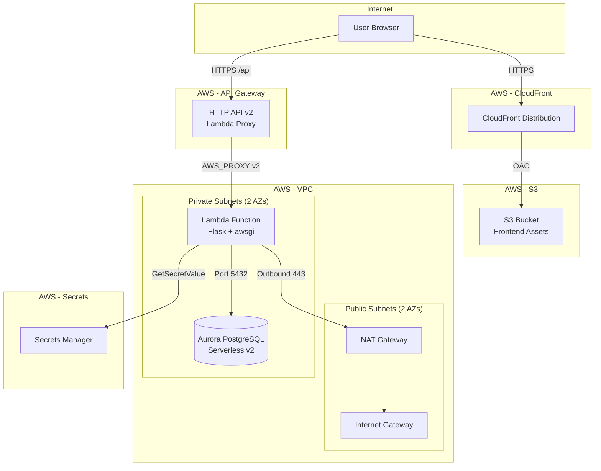
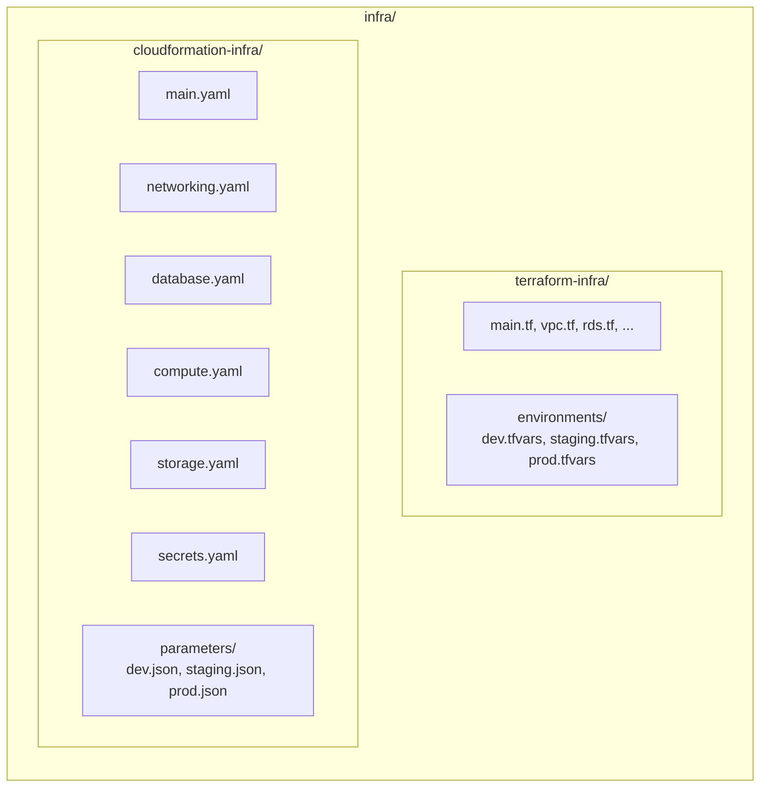
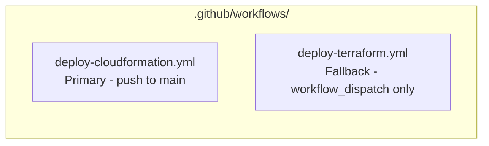
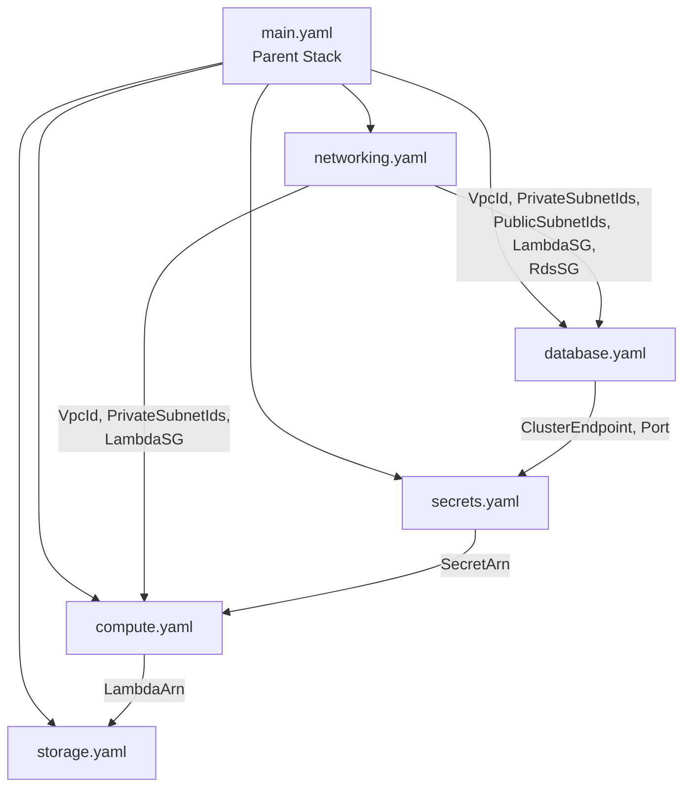

# Design Document: CloudFormation Dual Infrastructure

## Overview

This design describes the introduction of a dual IaC strategy for the TaskFlow application. The existing Terraform infrastructure is relocated to a subdirectory (`infra/terraform-infra/`), and a new CloudFormation-based infrastructure (`infra/cloudformation-infra/`) is created as the primary deployment mechanism. The CloudFormation templates provision the same serverless architecture (Lambda + API Gateway + Aurora Serverless v2 + S3/CloudFront) using nested stacks, with environment-specific parameter files and a new GitHub Actions workflow.

### Key Design Decisions

1. **Nested stacks for modularity**: The CloudFormation infrastructure uses a parent stack (`main.yaml`) that references five child stacks (networking, database, compute, storage, secrets). This mirrors the existing Terraform file-per-resource pattern and keeps each template focused and maintainable.
2. **Same architecture, different provisioning tool**: The CloudFormation templates create identical AWS resources to the existing Terraform configuration — same VPC layout, same Lambda/API Gateway pattern, same Aurora Serverless v2, same S3/CloudFront. No architectural changes to the running application.
3. **Parameter files per environment**: JSON parameter files (`dev.json`, `staging.json`, `prod.json`) provide environment-specific values, analogous to Terraform's `.tfvars` files.
4. **Consistent naming convention**: Resources follow `taskflow-{environment}-{resource-type}` pattern. This differs slightly from the existing Terraform convention (`{environment}-taskflow-{resource-type}`) to avoid naming collisions between the two IaC approaches.
5. **Terraform preserved as fallback**: The existing Terraform workflow is renamed and switched to `workflow_dispatch` only, ensuring it remains available but does not conflict with the new CloudFormation-based auto-deploy.
6. **Cross-stack exports**: All key outputs are exported with predictable names (`taskflow-{environment}-{output-key}`), enabling other stacks or tooling to reference them.

## Architecture



### Repository Structure After Migration



### CI/CD Workflow Structure



## Components and Interfaces

### CloudFormation Template Structure

```
infra/cloudformation-infra/
├── main.yaml                    # Parent stack - orchestrates nested stacks
├── networking.yaml              # VPC, subnets, IGW, NAT GW, route tables, security groups
├── database.yaml                # Aurora PostgreSQL Serverless v2 cluster + instance
├── compute.yaml                 # Lambda function, IAM role, API Gateway HTTP API
├── storage.yaml                 # S3 bucket, CloudFront distribution, OAC
├── secrets.yaml                 # Secrets Manager secret (DATABASE_URL, JWT_SECRET_KEY)
└── parameters/
    ├── dev.json                 # Dev environment parameters
    ├── staging.json             # Staging environment parameters
    └── prod.json                # Prod environment parameters
```

### Relocated Terraform Structure

```
infra/terraform-infra/
├── main.tf
├── variables.tf
├── outputs.tf
├── vpc.tf
├── rds.tf
├── secrets.tf
├── lambda.tf
├── api_gateway.tf
├── s3.tf
├── cloudfront.tf
└── environments/
    ├── dev.tfvars
    ├── staging.tfvars
    └── prod.tfvars
```

### Component Responsibilities

| Component | Template | Responsibility |
|-----------|----------|---------------|
| Networking | `networking.yaml` | VPC, 2 public subnets, 2 private subnets, IGW, NAT GW, EIP, route tables, Lambda SG, RDS SG |
| Database | `database.yaml` | Aurora PostgreSQL cluster (Serverless v2), DB instance, subnet group, encryption |
| Compute | `compute.yaml` | Lambda function, IAM execution role, API Gateway HTTP API, Lambda permission, CORS |
| Storage | `storage.yaml` | S3 frontend bucket, block public access, OAC, CloudFront distribution, bucket policy |
| Secrets | `secrets.yaml` | Secrets Manager secret with DATABASE_URL and JWT_SECRET_KEY |
| Parent | `main.yaml` | Orchestrates all nested stacks, passes parameters, aggregates outputs |

### Interface Contracts Between Nested Stacks



**Networking → Database**:
- `VpcId`, `PrivateSubnetIds`, `RdsSecurityGroupId`

**Networking → Compute**:
- `VpcId`, `PrivateSubnetIds`, `LambdaSecurityGroupId`

**Database → Secrets**:
- `ClusterEndpoint`, `ClusterPort`, `DatabaseName`

**Secrets → Compute**:
- `SecretArn`

**Compute → Storage** (for API URL in future if needed):
- `ApiGatewayInvokeUrl`

### Parent Stack Parameter Flow

The parent stack (`main.yaml`) accepts all parameters and distributes them to child stacks:

| Parameter | Type | Used By | Description |
|-----------|------|---------|-------------|
| `Environment` | String (AllowedValues: dev, staging, prod) | All stacks | Environment identifier |
| `VpcCidr` | String | networking | VPC CIDR block |
| `DBMinCapacity` | Number | database | Aurora min ACU |
| `DBMaxCapacity` | Number | database | Aurora max ACU |
| `DBMasterUsername` | String | database, secrets | Database master username |
| `DBMasterPassword` | String (NoEcho) | database, secrets | Database master password |
| `DBName` | String | database, secrets | Database name (default: taskflow) |
| `JwtSecretKey` | String (NoEcho, MinLength: 32) | secrets | JWT signing key |
| `LambdaMemorySize` | Number | compute | Lambda memory (default: 512) |
| `LambdaTimeout` | Number | compute | Lambda timeout (default: 30) |
| `LambdaS3Bucket` | String | compute | S3 bucket holding backend.zip |
| `LambdaS3Key` | String | compute | S3 key for backend.zip |

## Data Models

### CloudFormation Parameter File Format (dev.json)

```json
[
  { "ParameterKey": "Environment", "ParameterValue": "dev" },
  { "ParameterKey": "VpcCidr", "ParameterValue": "10.0.0.0/16" },
  { "ParameterKey": "DBMinCapacity", "ParameterValue": "0.5" },
  { "ParameterKey": "DBMaxCapacity", "ParameterValue": "2" },
  { "ParameterKey": "DBMasterUsername", "ParameterValue": "taskflow_admin" },
  { "ParameterKey": "DBName", "ParameterValue": "taskflow" },
  { "ParameterKey": "LambdaMemorySize", "ParameterValue": "512" },
  { "ParameterKey": "LambdaTimeout", "ParameterValue": "30" }
]
```

Note: `DBMasterPassword` and `JwtSecretKey` are passed via CLI `--parameter-overrides` from GitHub secrets, not stored in parameter files.

### Staging Parameter File (staging.json)

```json
[
  { "ParameterKey": "Environment", "ParameterValue": "staging" },
  { "ParameterKey": "VpcCidr", "ParameterValue": "10.1.0.0/16" },
  { "ParameterKey": "DBMinCapacity", "ParameterValue": "0.5" },
  { "ParameterKey": "DBMaxCapacity", "ParameterValue": "4" },
  { "ParameterKey": "DBMasterUsername", "ParameterValue": "taskflow_admin" },
  { "ParameterKey": "DBName", "ParameterValue": "taskflow" },
  { "ParameterKey": "LambdaMemorySize", "ParameterValue": "512" },
  { "ParameterKey": "LambdaTimeout", "ParameterValue": "30" }
]
```

### Production Parameter File (prod.json)

```json
[
  { "ParameterKey": "Environment", "ParameterValue": "prod" },
  { "ParameterKey": "VpcCidr", "ParameterValue": "10.2.0.0/16" },
  { "ParameterKey": "DBMinCapacity", "ParameterValue": "1" },
  { "ParameterKey": "DBMaxCapacity", "ParameterValue": "8" },
  { "ParameterKey": "DBMasterUsername", "ParameterValue": "taskflow_admin" },
  { "ParameterKey": "DBName", "ParameterValue": "taskflow" },
  { "ParameterKey": "LambdaMemorySize", "ParameterValue": "1024" },
  { "ParameterKey": "LambdaTimeout", "ParameterValue": "30" }
]
```

### CloudFormation Stack Outputs

| Output Key | Value Source | Export Name Pattern |
|-----------|-------------|-------------------|
| `ApiGatewayInvokeUrl` | `!GetAtt ComputeStack.Outputs.ApiInvokeUrl` | `taskflow-{env}-ApiGatewayInvokeUrl` |
| `FrontendBucketName` | `!GetAtt StorageStack.Outputs.BucketName` | `taskflow-{env}-FrontendBucketName` |
| `CloudFrontDistributionId` | `!GetAtt StorageStack.Outputs.DistributionId` | `taskflow-{env}-CloudFrontDistributionId` |
| `CloudFrontDomainName` | `!GetAtt StorageStack.Outputs.DomainName` | `taskflow-{env}-CloudFrontDomainName` |
| `LambdaFunctionName` | `!GetAtt ComputeStack.Outputs.FunctionName` | `taskflow-{env}-LambdaFunctionName` |
| `AuroraClusterEndpoint` | `!GetAtt DatabaseStack.Outputs.ClusterEndpoint` | `taskflow-{env}-AuroraClusterEndpoint` |

### Secrets Manager JSON Structure

```json
{
  "DATABASE_URL": "postgresql://taskflow_admin:{password}@{cluster-endpoint}:5432/taskflow",
  "JWT_SECRET_KEY": "{jwt-secret-value}"
}
```

This matches the existing `load_secrets()` function in `backend/wsgi.py` which expects `DATABASE_URL` and `JWT_SECRET_KEY` keys.

### Resource Naming Convention

All resources follow: `taskflow-{environment}-{resource-type}`

| Resource | Name Example (dev) |
|----------|-------------------|
| VPC | `taskflow-dev-vpc` |
| Public Subnet 1 | `taskflow-dev-public-subnet-1` |
| Private Subnet 1 | `taskflow-dev-private-subnet-1` |
| Internet Gateway | `taskflow-dev-igw` |
| NAT Gateway | `taskflow-dev-nat` |
| Lambda Function | `taskflow-dev-backend` |
| Lambda SG | `taskflow-dev-lambda-sg` |
| RDS SG | `taskflow-dev-rds-sg` |
| Aurora Cluster | `taskflow-dev-aurora-cluster` |
| S3 Bucket | `taskflow-dev-frontend` |
| CloudFront | (auto-generated ID, tagged `taskflow-dev-cdn`) |
| Secrets Manager | `taskflow-dev-secrets` |
| API Gateway | `taskflow-dev-api` |
| CloudFormation Stack | `taskflow-dev` (parent stack name) |

## Error Handling

### CloudFormation Deployment Errors

| Scenario | Handling |
|----------|----------|
| Template validation failure | `aws cloudformation validate-template` fails pre-deploy; pipeline halts |
| Stack creation fails (CREATE_FAILED) | CloudFormation auto-rolls back all resources; pipeline reports failure |
| Stack update fails (UPDATE_ROLLBACK_COMPLETE) | CloudFormation rolls back to previous working state; pipeline reports failure |
| Nested stack failure | Parent stack detects child failure and initiates rollback of all stacks |
| Parameter validation error | `aws cloudformation deploy` fails immediately with descriptive error |
| Resource limit exceeded | Stack fails with specific limit error; manual quota increase needed |
| Name collision with Terraform resources | Different naming convention (`taskflow-{env}-*` vs `{env}-taskflow-*`) prevents conflicts |

### CI/CD Pipeline Error Handling

| Stage | Failure Action |
|-------|---------------|
| Tests fail (pytest/vitest) | Pipeline halts; no build or deploy steps execute |
| Build fails | `set -euo pipefail` causes immediate exit; pipeline halts |
| Backend artifact upload to S3 fails | Pipeline halts before CloudFormation deploy |
| `aws cloudformation deploy` fails | Pipeline halts; skips frontend sync, Lambda update, CloudFront invalidation |
| Lambda code update fails | Pipeline reports failure; previous Lambda version remains active |
| Frontend S3 sync fails | Pipeline reports failure; CloudFront continues serving cached content |
| CloudFront invalidation fails | Pipeline reports warning; old cache expires naturally (TTL-based) |

### Terraform Workflow Preservation Errors

| Scenario | Handling |
|----------|----------|
| Working directory not found | Terraform commands fail if `infra/terraform-infra/` doesn't exist; pipeline fails explicitly |
| State file path unchanged | Backend config uses same S3 key patterns as before — no state loss |
| Accidental auto-trigger | `workflow_dispatch` only prevents unintended runs; manual trigger required |

### Stack Rollback Behavior

CloudFormation provides automatic rollback by default:
- **CREATE_FAILED**: All resources created during the failed attempt are deleted
- **UPDATE_ROLLBACK_COMPLETE**: Stack reverts to the last known good state
- **Nested stack failure**: Propagates to parent, triggering full rollback

This is a significant advantage over Terraform where partial applies can leave infrastructure in an inconsistent state requiring manual intervention.

## Testing Strategy

### Why Property-Based Testing Does NOT Apply

This feature consists entirely of:
- **Infrastructure as Code (CloudFormation YAML)**: Declarative resource definitions, not functions with variable inputs/outputs
- **CI/CD pipeline configuration (GitHub Actions YAML)**: Workflow orchestration
- **File relocation operations**: Moving existing files between directories
- **Parameter files (JSON)**: Static configuration values

None of these produce meaningful "for all inputs X, property P(X) holds" statements. The correct testing approach uses template validation, linting, integration tests, and smoke tests.

### Testing Approach

#### 1. CloudFormation Template Validation

- `aws cloudformation validate-template --template-body file://main.yaml` for each template
- Validate all nested stack templates individually
- Validate parameter file JSON syntax with `python -m json.tool`
- Use `cfn-lint` to check templates against AWS CloudFormation resource specification

#### 2. Template Structural Checks

- Verify `main.yaml` references all 5 nested stacks
- Verify each nested stack declares required Parameters
- Verify all cross-stack references (Outputs → Parameters) are wired correctly
- Verify all resources follow the `taskflow-{environment}-{resource-type}` naming convention
- Verify parameter files contain all required keys for each environment

#### 3. Security Validation

- Verify RDS security group only allows inbound from Lambda SG on port 5432
- Verify Lambda SG has no inbound rules
- Verify S3 bucket has all four Block Public Access settings enabled
- Verify Secrets Manager secret uses AWS-managed KMS key
- Verify `DBMasterPassword` and `JwtSecretKey` parameters use `NoEcho: true`
- Verify Lambda IAM role follows least-privilege (scoped to specific secret ARN)

#### 4. CI/CD Workflow Validation

- Verify `deploy-cloudformation.yml` triggers on push to main
- Verify `deploy-terraform.yml` triggers only on `workflow_dispatch`
- Verify deployment stages require environment protection (manual approval for staging/prod)
- Verify credential usage is scoped per environment
- Verify test failures halt the pipeline (no deploy steps after failed tests)

#### 5. Integration Tests (Post-Deploy to Dev)

- Hit API Gateway URL `/health` endpoint and verify 200 response
- Verify CloudFront serves `index.html` at root
- Verify CloudFront returns `index.html` for arbitrary paths (SPA fallback)
- Verify Lambda connects to Aurora through VPC
- Verify CloudFormation stack outputs match expected format

#### 6. File Relocation Verification

- Verify `infra/terraform-infra/` contains all expected Terraform files
- Verify `infra/terraform-infra/environments/` contains all tfvars files
- Verify `infra/` root has no loose files (only the two subdirectories)
- Verify relocated file contents are byte-for-byte identical (SHA comparison)

#### 7. Naming Convention Verification

- Verify all CloudFormation resources follow `taskflow-{env}-{type}` pattern
- Verify no naming collision with existing Terraform-provisioned resources (which use `{env}-taskflow-{type}`)
- Verify stack exports follow `taskflow-{env}-{output-key}` pattern
