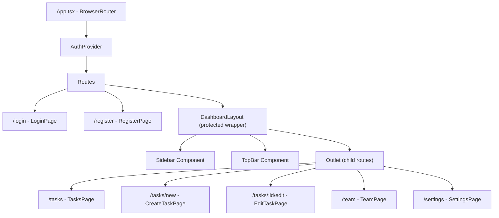

# Design Document: Dashboard Sidebar Layout

## Overview

This design describes the implementation of a persistent dashboard layout for the TaskFlow application. The layout wraps all authenticated (protected) routes and consists of three major regions:

1. **Sidebar** — A fixed left navigation panel (240px) with brand logo, navigation items, and a logout action.
2. **Top Bar** — A sticky header (64px) displaying authenticated user information (avatar, name, role).
3. **Content Area** — A scrollable main region where page-specific content renders via React Router's `<Outlet>`.

The layout adapts to three responsive breakpoints:
- **≥1024px**: Full sidebar with icons and labels
- **640–1023px**: Collapsed sidebar with icons only (64px)
- **<640px**: Hidden sidebar with hamburger toggle overlay

The implementation uses React 18, TypeScript, CSS Modules, and React Router v6. No external UI libraries.

---

## Architecture



The `DashboardLayout` component replaces the current per-route `<ProtectedRoute>` wrapper. It:
1. Checks authentication (redirects to `/login` if unauthenticated)
2. Renders the Sidebar + TopBar chrome
3. Renders child routes via `<Outlet />`

This uses React Router v6's nested route pattern with a layout route.

---

## Components and Interfaces

### Component Tree

```
DashboardLayout
├── Sidebar
│   ├── BrandLogo
│   ├── NavItem (×3: Todo, Team Members, Settings)
│   └── NavItem (Logout, pinned bottom)
├── TopBar
│   ├── LeftSection (page title placeholder)
│   └── UserInfo
│       ├── Avatar (initials)
│       ├── UserName
│       └── RoleLabel
└── <Outlet /> (content area)
```

### New Files

| File | Purpose |
|------|---------|
| `src/components/DashboardLayout.tsx` | Layout wrapper component |
| `src/components/DashboardLayout.module.css` | Layout styles |
| `src/components/Sidebar.tsx` | Sidebar navigation component |
| `src/components/Sidebar.module.css` | Sidebar styles |
| `src/components/TopBar.tsx` | Top bar header component |
| `src/components/TopBar.module.css` | Top bar styles |
| `src/utils/navigation.ts` | Pure utility functions (getInitials, truncateName, isActiveRoute) |
| `src/utils/navigation.test.ts` | Unit + property tests for utility functions |

### Interfaces

```typescript
// Props for Sidebar component
interface SidebarProps {
  collapsed: boolean;
  mobileOpen: boolean;
  onCloseMobile: () => void;
}

// Props for TopBar component
interface TopBarProps {
  onHamburgerClick: () => void;
  showHamburger: boolean;
}

// Navigation item configuration
interface NavItemConfig {
  label: string;
  path: string;
  icon: React.ReactNode;
}

// Utility function signatures
function getInitials(fullName: string): string;
function truncateName(name: string, maxLength?: number): string;
function isActiveRoute(currentPath: string, routePrefix: string): boolean;
```

### DashboardLayout Component

Manages responsive state via a custom hook that listens to `window.matchMedia`:

```typescript
type SidebarMode = 'full' | 'collapsed' | 'hidden';

function useSidebarMode(): SidebarMode {
  // Returns 'full' for ≥1024px, 'collapsed' for 640-1023px, 'hidden' for <640px
}
```

The layout component holds `mobileOpen` state (boolean) for the hamburger toggle at <640px.

### Routing Integration

`App.tsx` will be updated to use a layout route:

```typescript
<Route element={<DashboardLayout />}>
  <Route path="/tasks" element={<TasksPage />} />
  <Route path="/tasks/new" element={<CreateTaskPage />} />
  <Route path="/tasks/:id/edit" element={<EditTaskPage />} />
  <Route path="/team" element={<TeamPage />} />
  <Route path="/settings" element={<SettingsPage />} />
</Route>
```

The `DashboardLayout` internally checks `token` from `useAuth()` and redirects to `/login` if unauthenticated, replacing the per-route `<ProtectedRoute>` usage for dashboard pages.

---

## Data Models

No new data models are introduced. The layout consumes the existing `User` interface from `src/types/index.ts`:

```typescript
interface User {
  id: number;
  full_name: string;  // Used for avatar initials and display name
  email: string;
  created_at: string;
}
```

### Navigation Configuration (Static Data)

```typescript
const NAV_ITEMS: NavItemConfig[] = [
  { label: 'Todo', path: '/tasks', icon: <CheckSquareIcon /> },
  { label: 'Team Members', path: '/team', icon: <UsersIcon /> },
  { label: 'Settings', path: '/settings', icon: <SettingsIcon /> },
];
```

Icons are inline SVG elements styled at 20px with 1.5px stroke, matching the design system's outlined icon style.

---

## Correctness Properties

*A property is a characteristic or behavior that should hold true across all valid executions of a system — essentially, a formal statement about what the system should do. Properties serve as the bridge between human-readable specifications and machine-verifiable correctness guarantees.*

### Property 1: Route-prefix matching correctly identifies active navigation

*For any* URL path string and any set of navigation route prefixes, `isActiveRoute(path, prefix)` returns `true` if and only if the path starts with that prefix. Furthermore, for any set of navigation items evaluated against a single path, at most one item should be marked active (the longest matching prefix wins when multiple prefixes could match).

**Validates: Requirements 2.9, 3.1, 3.2, 3.4, 7.8**

### Property 2: Initials derivation produces valid uppercase initials

*For any* non-empty string `fullName`, `getInitials(fullName)` shall return a string of length 1 or 2 containing only uppercase alphabetic characters, where the first character is derived from the first word and the second character (if present) is derived from the last word of the input. For single-word names, the result is exactly 1 character.

**Validates: Requirements 4.2**

### Property 3: Name truncation preserves short names and truncates long names

*For any* string `name` and threshold of 20 characters: if `name.length <= 20`, then `truncateName(name)` returns `name` unchanged; if `name.length > 20`, then `truncateName(name)` returns a string of exactly 21 characters (20 visible + ellipsis character "…") that starts with the first 20 characters of the original name.

**Validates: Requirements 4.7**

---

## Error Handling

| Scenario | Handling |
|----------|----------|
| `user` is `null` in AuthContext | TopBar renders a skeleton placeholder (empty avatar circle + gray text blocks). No crash. |
| `full_name` is empty string | `getInitials("")` returns `"?"` as fallback. `truncateName("")` returns `""`. |
| Navigation to unknown route | No nav item highlighted (all inactive state). Layout still renders. |
| `useAuth()` called outside `AuthProvider` | Existing error throw in context hook. DashboardLayout is always inside AuthProvider. |
| Window resize during render | `useSidebarMode` uses `matchMedia` listeners with cleanup in useEffect. No memory leaks. |
| Mobile sidebar open + resize to desktop | `mobileOpen` resets to `false` when mode transitions away from `'hidden'`. |

---

## Testing Strategy

### Unit Tests (Vitest + React Testing Library)

**Component tests:**
- `DashboardLayout.test.tsx` — renders sidebar, top bar, and outlet; redirects when unauthenticated
- `Sidebar.test.tsx` — renders all nav items in order; logout calls context; active item gets correct class and aria-current
- `TopBar.test.tsx` — renders user name, initials avatar, "Member" label; handles null user; truncates long names

**Utility tests:**
- `navigation.test.ts` — example-based tests for `getInitials`, `truncateName`, `isActiveRoute`

### Property-Based Tests (fast-check)

The utility functions in `src/utils/navigation.ts` are pure functions with large input spaces that benefit from property-based testing. We will use `fast-check` as the PBT library.

**Configuration:**
- Minimum 100 iterations per property test
- Each test tagged with property reference comment

**Tests:**
- Property 1: Generate random path strings and route prefixes, verify `isActiveRoute` correctness
- Property 2: Generate random non-empty strings, verify `getInitials` output constraints
- Property 3: Generate random strings of varying length, verify `truncateName` output constraints

**Tag format:** `// Feature: dashboard-sidebar-layout, Property {N}: {description}`

### Test Files

| File | Type |
|------|------|
| `src/utils/navigation.test.ts` | Unit tests + property-based tests |
| `src/components/DashboardLayout.test.tsx` | Component unit tests |
| `src/components/Sidebar.test.tsx` | Component unit tests |
| `src/components/TopBar.test.tsx` | Component unit tests |

### What We Don't Test with PBT
- CSS rendering, media queries, transitions (visual — use manual review)
- React component rendering (use example-based React Testing Library tests)
- Hover/focus states (CSS-only, verified by design system compliance)
