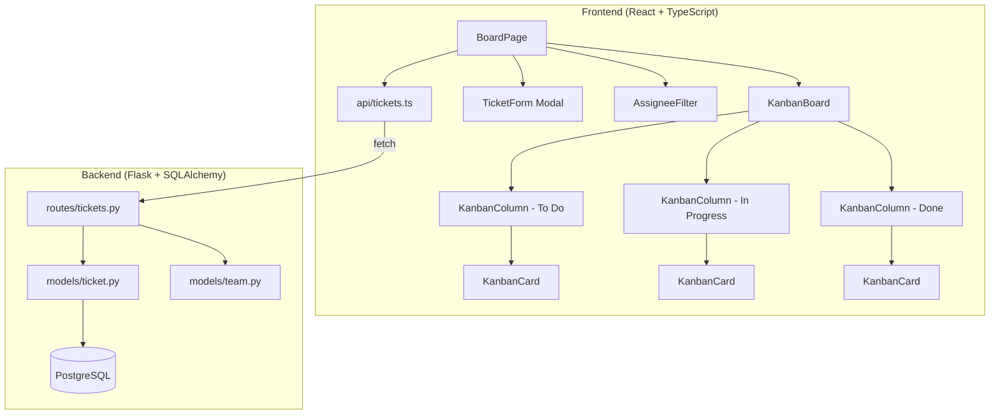
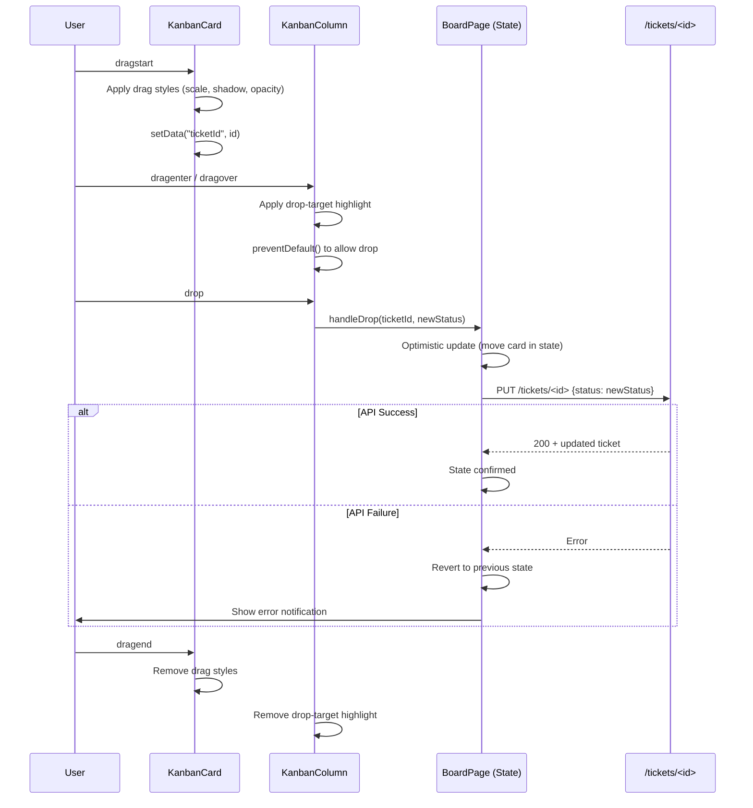

# Design Document: Kanban Board

## Overview

The Kanban Board feature adds a visual, column-based interface to TaskFlow for managing team-scoped tickets. It introduces a new `Ticket` model (separate from the existing personal `Task` model) with team association and assignee support, a complete REST API under `/tickets`, and a set of React components implementing drag-and-drop status transitions via the HTML5 Drag and Drop API.

Key design decisions:
- **Separate Ticket model**: Tickets are team-scoped work items distinct from personal Tasks. This avoids breaking existing Task semantics and allows independent evolution.
- **Team scoping**: Tickets are associated with a team via `team_id`. All team members see all team tickets; only the creator can edit/delete.
- **HTML5 DnD**: No external drag-and-drop library — uses native browser API for lightweight implementation.
- **Optimistic updates**: Drag-and-drop status changes update the UI immediately and revert on API failure.
- **CSS Modules**: Follows existing project convention for component styling.

## Architecture



### Data Flow

1. `BoardPage` mounts → calls `getTickets(token, teamId)` → API returns team-scoped tickets
2. `KanbanBoard` groups tickets by status into three `KanbanColumn` components
3. User drags a `KanbanCard` → optimistic state update → `updateTicketStatus(token, ticketId, newStatus)` API call
4. On API success: state stays. On failure: revert to previous state, show error toast.

## Components and Interfaces

### Backend Components

#### `models/ticket.py` — Ticket Model

```python
class Ticket(db.Model):
    __tablename__ = "tickets"

    id: int                    # Primary key
    title: str                 # 1-200 chars, required
    description: str           # 1-1000 chars, required
    priority: Priority         # Enum: LOW, MEDIUM, HIGH
    status: Status             # Enum: PENDING, INPROGRESS, COMPLETED
    team_id: int               # FK → teams.id, required
    creator_id: int            # FK → users.id, required (who created it)
    assignee_id: int | None    # FK → users.id, nullable (who it's assigned to)
    created_at: datetime
    updated_at: datetime
```

Reuses the existing `Priority` and `Status` enums from `models/task.py`.

#### `routes/tickets.py` — Tickets Blueprint

| Method | Endpoint | Description |
|--------|----------|-------------|
| GET | `/tickets` | Get all tickets for the user's team |
| POST | `/tickets` | Create a new ticket |
| PUT | `/tickets/<id>` | Update a ticket (owner only) |
| DELETE | `/tickets/<id>` | Delete a ticket (owner only) |
| GET | `/tickets/members` | Get team members for assignee dropdown |

### Frontend Components

| Component | Location | Responsibility |
|-----------|----------|----------------|
| `BoardPage` | `pages/BoardPage.tsx` | Route page — fetches tickets, manages board state |
| `KanbanBoard` | `components/board/KanbanBoard.tsx` | Renders three columns, handles DnD context |
| `KanbanColumn` | `components/board/KanbanColumn.tsx` | Single column — renders cards, drop target |
| `KanbanCard` | `components/board/KanbanCard.tsx` | Single ticket card — draggable, shows details |
| `TicketForm` | `components/board/TicketForm.tsx` | Modal form for create/edit ticket |
| `AssigneeFilter` | `components/board/AssigneeFilter.tsx` | Multi-select filter by assignee |

#### `api/tickets.ts` — API Module

```typescript
getTickets(token: string): Promise<Ticket[]>
createTicket(token: string, data: TicketPayload): Promise<Ticket>
updateTicket(token: string, ticketId: number, data: Partial<TicketPayload>): Promise<Ticket>
deleteTicket(token: string, ticketId: number): Promise<void>
getTeamMembers(token: string): Promise<TeamMember[]>
```

## Data Models

### Backend: Ticket Model

```python
from extensions import db
from models.task import Priority, Status
from datetime import datetime

class Ticket(db.Model):
    __tablename__ = "tickets"

    id = db.Column(db.Integer, primary_key=True)
    title = db.Column(db.String(200), nullable=False)
    description = db.Column(db.String(1000), nullable=False)
    priority = db.Column(db.Enum(Priority), nullable=False)
    status = db.Column(db.Enum(Status), nullable=False, default=Status.PENDING)
    team_id = db.Column(db.Integer, db.ForeignKey("teams.id"), nullable=False, index=True)
    creator_id = db.Column(db.Integer, db.ForeignKey("users.id"), nullable=False, index=True)
    assignee_id = db.Column(db.Integer, db.ForeignKey("users.id"), nullable=True, index=True)
    created_at = db.Column(db.DateTime, default=datetime.utcnow, nullable=False)
    updated_at = db.Column(db.DateTime, default=datetime.utcnow, onupdate=datetime.utcnow, nullable=False)

    team = db.relationship("Team", backref="tickets")
    creator = db.relationship("User", foreign_keys=[creator_id], backref="created_tickets")
    assignee = db.relationship("User", foreign_keys=[assignee_id], backref="assigned_tickets")

    def to_dict(self) -> dict:
        return {
            "id": self.id,
            "title": self.title,
            "description": self.description,
            "priority": self.priority.value,
            "status": self.status.value,
            "team_id": self.team_id,
            "creator_id": self.creator_id,
            "assignee_id": self.assignee_id,
            "assignee_name": self.assignee.full_name if self.assignee else None,
            "created_at": self.created_at.isoformat(),
            "updated_at": self.updated_at.isoformat(),
        }
```

### Frontend: TypeScript Types

```typescript
// Added to frontend/src/types/index.ts

export type TicketPriority = 'LOW' | 'MEDIUM' | 'HIGH';
export type TicketStatus = 'PENDING' | 'INPROGRESS' | 'COMPLETED';
export type ColumnId = TicketStatus;

export interface Ticket {
  id: number;
  title: string;
  description: string;
  priority: TicketPriority;
  status: TicketStatus;
  team_id: number;
  creator_id: number;
  assignee_id: number | null;
  assignee_name: string | null;
  created_at: string;
  updated_at: string;
}

export interface TicketPayload {
  title: string;
  description: string;
  priority: TicketPriority;
  status?: TicketStatus;
  assignee_id?: number | null;
}

export interface KanbanColumnDef {
  id: ColumnId;
  title: string;  // "To Do", "In Progress", "Done"
  tickets: Ticket[];
}
```

### API Contract

#### GET `/tickets`

Returns all tickets for the user's active team.

**Request Headers:**
```
Authorization: Bearer <jwt_token>
```

**Response 200:**
```json
[
  {
    "id": 1,
    "title": "Implement login",
    "description": "Build the login form and API integration",
    "priority": "HIGH",
    "status": "INPROGRESS",
    "team_id": 1,
    "creator_id": 2,
    "assignee_id": 3,
    "assignee_name": "Alice Johnson",
    "created_at": "2024-01-15T10:00:00",
    "updated_at": "2024-01-15T12:30:00"
  }
]
```

**Team resolution logic:**
1. If user owns a team → use that team
2. Else if user is a member of a team → use that team
3. Else → return only the user's own tickets (tickets with `creator_id = user_id` and no team)

#### POST `/tickets`

**Request Body:**
```json
{
  "title": "New feature",
  "description": "Implement the dashboard widget",
  "priority": "MEDIUM",
  "status": "PENDING",
  "assignee_id": 3
}
```

- `status` defaults to `"PENDING"` if omitted
- `assignee_id` is optional (null means unassigned)

**Response 201:** Created ticket object (same shape as GET response item)

**Response 400:**
```json
{
  "errors": {
    "title": "Title is required.",
    "assignee_id": "Assignee must be a member of the team."
  }
}
```

#### PUT `/tickets/<ticket_id>`

**Request Body:** Same shape as POST, all fields optional (partial update supported for status-only drag updates).

**Response 200:** Updated ticket object
**Response 400:** Validation errors
**Response 403:** `{"error": "You do not have permission to update this ticket."}`
**Response 404:** `{"error": "Ticket not found."}`

#### DELETE `/tickets/<ticket_id>`

**Response 200:** `{"message": "Ticket <id> deleted successfully."}`
**Response 403:** `{"error": "You do not have permission to delete this ticket."}`
**Response 404:** `{"error": "Ticket not found."}`

#### GET `/tickets/members`

Returns team members for the assignee dropdown/filter.

**Response 200:**
```json
[
  {
    "id": 1,
    "full_name": "John Doe",
    "email": "john@example.com"
  }
]
```

### Drag and Drop Implementation

The HTML5 Drag and Drop API is used with this event flow:



**Key implementation details:**

- `KanbanCard`: Sets `draggable={true}`, handles `onDragStart` (sets dataTransfer with ticket ID, applies visual styles), `onDragEnd` (cleans up styles)
- `KanbanColumn`: Handles `onDragOver` (preventDefault to allow drop, add highlight), `onDragEnter`/`onDragLeave` (toggle highlight), `onDrop` (extract ticket ID, call parent handler)
- `BoardPage`: Manages `tickets` state array; `handleDrop` performs optimistic reorder then fires API call
- Same-column drops are detected and ignored (no API call)
- Keyboard accessibility: Each card has a "Move to..." button visible on focus, opening a menu to select target column

### State Management

```
BoardPage (state owner)
├── tickets: Ticket[]              — all tickets from API
├── filteredTickets: Ticket[]      — tickets after assignee filter applied
├── selectedAssignees: number[]    — active filter (empty = show all)
├── loading: boolean
├── error: string | null
├── formOpen: boolean
├── editingTicket: Ticket | null
│
├── KanbanBoard
│   ├── KanbanColumn (PENDING)
│   │   └── KanbanCard[]
│   ├── KanbanColumn (INPROGRESS)
│   │   └── KanbanCard[]
│   └── KanbanColumn (COMPLETED)
│       └── KanbanCard[]
│
├── TicketForm (modal — create or edit mode)
└── AssigneeFilter
```

State flows top-down via props. Mutations flow up via callback props:
- `onDrop(ticketId, newStatus)` — drag-and-drop status change
- `onCreateTicket(payload)` — new ticket creation
- `onUpdateTicket(ticketId, payload)` — edit form submission
- `onDeleteTicket(ticketId)` — delete confirmation

## Correctness Properties

*Property-based testing is not applicable for this feature.* The project conventions explicitly require unit tests only (no PBT). This feature involves CRUD operations with team-scoped access control, UI rendering with drag-and-drop interactions, and state management with optimistic updates — all best validated with example-based unit tests.

### Property 1: Team-scoped ticket visibility

*For any* authenticated user belonging to a team, the GET /tickets endpoint SHALL return all tickets associated with that team (not just the user's own tickets), and for a user with no team, it SHALL return only their own tickets.

**Validates: Requirements 8.1, 8.2, 8.3**

### Property 2: Drag-drop optimistic update and revert

*For any* ticket card dropped onto a different column, the UI SHALL optimistically update the card's position immediately, and if the subsequent API call fails, the card SHALL revert to its original column and position.

**Validates: Requirements 4.3, 4.5**

### Property 3: Creator-only mutation access

*For any* ticket update or delete request, the API SHALL permit the operation only if the requesting user is the ticket's creator, and SHALL return 403 for all other users regardless of team membership.

**Validates: Requirements 5.6, 6.4, 8.6**

## Error Handling

| Scenario | Backend Response | Frontend Behavior |
|----------|-----------------|-------------------|
| Validation failure (create/edit) | 400 + `{errors: {...}}` | Display errors inline next to form fields |
| Unauthorized access | 401 | Redirect to login page |
| Permission denied (not ticket owner) | 403 + `{error: "..."}` | Show error toast/message |
| Ticket not found | 404 + `{error: "..."}` | Show error message, remove stale card |
| Assignee not a team member | 400 + `{errors: {assignee_id: "..."}}` | Show error inline in form |
| Server error | 500 + `{error: "..."}` | Show generic error message, preserve form input |
| Network error (fetch throws) | N/A (TypeError) | Show "Unable to connect" message, preserve state |
| Drag-drop status update fails | 400/500/timeout | Revert card to original column, show error for 5+ seconds |
| Team members fetch fails | 400/500/network | Show "filter unavailable" message, display all tickets |

### Error handling patterns:
- All API functions throw on non-ok responses (consistent with existing `api/tasks.ts` pattern)
- `BoardPage` wraps API calls in try/catch blocks
- Form errors are stored as `Record<string, string>` and displayed inline
- Network errors use the existing `NetworkError` class from `types/index.ts`
- Optimistic updates store previous state before mutation for rollback

## Testing Strategy

**No property-based tests** — unit tests only, as specified by project conventions.

### Backend Tests (`backend/tests/test_tickets.py`)

| Test Category | Examples |
|---------------|----------|
| GET /tickets | Returns team-scoped tickets; returns empty for no-team user; requires auth |
| POST /tickets | Creates ticket with valid data; rejects missing fields; validates assignee is team member; defaults status to PENDING |
| PUT /tickets/<id> | Updates all fields; rejects invalid data; returns 403 for non-owner; moves ticket between statuses |
| DELETE /tickets/<id> | Deletes owned ticket; returns 403 for non-owner; returns 404 for missing ticket |
| GET /tickets/members | Returns team members; returns empty for no-team user |
| Model tests | `Ticket.to_dict()` serialization; relationship loading |

### Frontend Tests

| File | Tests |
|------|-------|
| `api/tickets.test.ts` | Success and error paths for each API function |
| `components/board/KanbanBoard.test.tsx` | Renders three columns; groups tickets by status; handles empty state |
| `components/board/KanbanColumn.test.tsx` | Renders ticket count in header; renders cards; applies drop-target styles |
| `components/board/KanbanCard.test.tsx` | Renders title, description, priority badge, assignee; triggers drag events; shows edit/delete actions on hover |
| `components/board/TicketForm.test.tsx` | Renders create mode; renders edit mode with pre-filled data; validates required fields; shows API errors |
| `components/board/AssigneeFilter.test.tsx` | Renders member list; applies filter on selection; defaults to all |
| `pages/BoardPage.test.tsx` | Loading state; error state with retry; successful data load; drag-and-drop updates status |

### Test approach:
- Mock `fetch` globally with `vi.stubGlobal` — no real HTTP calls
- Use in-memory SQLite for backend tests
- Test each component in isolation with props
- Test `BoardPage` integration with mocked API responses
- Every route success + failure path covered
- Every component renders + interactions tested
