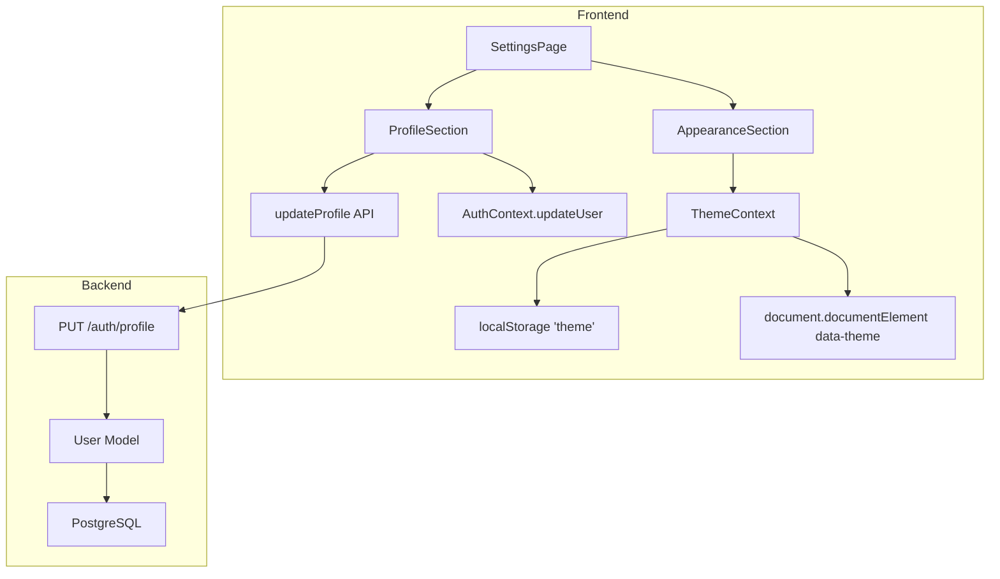

# Design Document: Settings Page

## Overview

The Settings page replaces the existing "Coming Soon" placeholder at `/settings` within the authenticated DashboardLayout. It provides two functional sections:

1. **Profile Section** — Displays the current user's full name and email in editable form fields, with client-side validation and server-side persistence via a new `PUT /auth/profile` endpoint.
2. **Appearance Section** — A light/dark theme toggle that switches CSS custom properties, persists the preference to localStorage, and applies the theme before first paint to avoid flash.

The implementation spans three layers:
- **Backend**: A new `PUT /auth/profile` route in the existing `auth_bp` blueprint
- **Frontend**: A new `SettingsPage` component, a `ThemeContext` provider, an updated `index.css` with dark-mode variable overrides, and a new `updateProfile` API function
- **AuthContext extension**: A new `updateUser` method so the profile form can update the cached user without re-logging in

---

## Architecture



### Data Flow — Profile Update

1. User edits fields and submits the form in `ProfileSection`
2. Client-side validation runs (non-empty name ≤255 chars, valid email ≤254 chars)
3. If valid, `updateProfile(token, { full_name, email })` sends `PUT /auth/profile`
4. Backend validates, updates the database, returns the updated user object
5. Frontend calls `AuthContext.updateUser(updatedUser)` to sync local state and localStorage
6. Success toast/banner is shown

### Data Flow — Theme Toggle

1. User clicks "Dark" or "Light" in the `AppearanceSection`
2. `ThemeContext.setTheme('dark' | 'light')` is called
3. Context sets `data-theme` attribute on `<html>` and persists to `localStorage.theme`
4. CSS custom properties under `[data-theme="dark"]` selector take effect immediately

---

## Components and Interfaces

### New Files

| File | Purpose |
|------|---------|
| `frontend/src/pages/SettingsPage.tsx` | Page component with Profile and Appearance sections |
| `frontend/src/pages/SettingsPage.module.css` | Styles for the settings page |
| `frontend/src/context/ThemeContext.tsx` | Theme state provider and hook |
| `frontend/src/api/profile.ts` | `updateProfile()` API function |
| `backend/routes/auth.py` (modified) | New `PUT /auth/profile` route added |
| `frontend/src/index.css` (modified) | Dark theme CSS variable overrides |
| `frontend/src/App.tsx` (modified) | Replace ComingSoon with SettingsPage, wrap with ThemeProvider |
| `frontend/src/context/AuthContext.tsx` (modified) | Add `updateUser` method |
| `frontend/src/types/index.ts` (modified) | Add `ThemeContextType`, `ProfileUpdatePayload` |

### ThemeContext Interface

```typescript
// frontend/src/types/index.ts (additions)
export type Theme = 'light' | 'dark';

export interface ThemeContextType {
  theme: Theme;
  setTheme: (theme: Theme) => void;
}

export interface ProfileUpdatePayload {
  full_name: string;
  email: string;
}

export interface ProfileUpdateResponse {
  id: number;
  full_name: string;
  email: string;
  created_at: string;
}
```

### ThemeContext Provider

```typescript
// frontend/src/context/ThemeContext.tsx
function ThemeProvider({ children }: { children: React.ReactNode }) {
  const [theme, setThemeState] = useState<Theme>(() => {
    const stored = localStorage.getItem('theme');
    if (stored === 'light' || stored === 'dark') return stored;
    return 'light';
  });

  useEffect(() => {
    document.documentElement.setAttribute('data-theme', theme);
    localStorage.setItem('theme', theme);
  }, [theme]);

  const setTheme = (newTheme: Theme): void => {
    setThemeState(newTheme);
  };

  return (
    <ThemeContext.Provider value={{ theme, setTheme }}>
      {children}
    </ThemeContext.Provider>
  );
}
```

**Critical**: The initial theme must be applied in a synchronous `<script>` in `index.html` (or inline at the top of ThemeProvider's initializer) to prevent flash of incorrect theme (FOIT). The `useState` initializer reads localStorage synchronously, and a layout effect applies `data-theme` before the browser paints.

### AuthContext Extension

Add an `updateUser` method to `AuthContextType`:

```typescript
export interface AuthContextType {
  token: string | null;
  user: User | null;
  login: (token: string, refreshToken: string, user: User) => void;
  logout: () => void;
  updateUser: (user: User) => void;  // NEW
}
```

Implementation: updates state + localStorage user entry.

### Profile API Function

```typescript
// frontend/src/api/profile.ts
export async function updateProfile(
  token: string,
  payload: ProfileUpdatePayload
): Promise<ProfileUpdateResponse> {
  // PUT to ${API_URL}/auth/profile with Bearer token
  // Returns updated user object on 200
  // Throws error object on 400/409/401/500
}
```

### Backend Endpoint — PUT /auth/profile

Added to `backend/routes/auth.py`:

```python
@auth_bp.route("/profile", methods=["PUT"])
@jwt_required()
def update_profile():
    """Update authenticated user's full_name and email."""
    # 1. Get current user from JWT identity
    # 2. Parse and validate full_name and email from request body
    # 3. Check email uniqueness (exclude current user)
    # 4. Update fields, commit, return user.to_dict() with 200
    # 5. On validation errors: 400
    # 6. On email conflict: 409
    # 7. On DB error: rollback, 500
```

### SettingsPage Component Structure

```
SettingsPage
├── Page Title ("Settings")
├── Card: Profile Section
│   ├── Section Title ("Profile")
│   ├── Full Name Input (controlled, pre-filled from AuthContext)
│   ├── Email Input (controlled, pre-filled from AuthContext)
│   ├── Inline validation errors
│   ├── Success message banner
│   └── Save Button (disabled while loading)
└── Card: Appearance Section
    ├── Section Title ("Appearance")
    └── Theme Toggle (Light | Dark segmented control)
```

---

## Data Models

### Existing User Model (no changes needed)

```python
class User(db.Model):
    __tablename__ = "users"
    id = db.Column(db.Integer, primary_key=True)
    full_name = db.Column(db.String(255), nullable=False)
    email = db.Column(db.String(254), unique=True, nullable=False, index=True)
    password = db.Column(db.String(512), nullable=False)
    created_at = db.Column(db.DateTime, default=datetime.utcnow, nullable=False)
```

The `PUT /auth/profile` endpoint modifies `full_name` and `email` only. The `password` field is explicitly ignored if present in the request body.

### Theme State (Client-Only)

- Stored in `localStorage` under key `"theme"`
- Valid values: `"light"` | `"dark"`
- Applied via `data-theme` attribute on `<html>` element
- CSS variables scoped under `[data-theme="dark"]` selector

### Dark Theme CSS Variables

```css
[data-theme="dark"] {
  --color-primary: #00BCD4;        /* unchanged */
  --color-background: #1A1A2E;
  --color-surface: #2D2D44;
  --color-border: #3D3D5C;
  --color-text-main: #F0F4F8;
  --color-text-muted: #9CA3AF;
  --color-text-sub: #D1D5DB;
  --color-success: #10B981;
  --color-warning: #F59E0B;
  --color-error: #EF4444;
  --color-info: #3B82F6;
}

[data-theme="dark"] input,
[data-theme="dark"] select,
[data-theme="dark"] textarea {
  background: #2D2D44;
  color: #F0F4F8;
  border-color: #3D3D5C;
}

[data-theme="dark"] input::placeholder,
[data-theme="dark"] textarea::placeholder {
  color: #9CA3AF;
}
```

---

## Correctness Properties

*A property is a characteristic or behavior that should hold true across all valid executions of a system — essentially, a formal statement about what the system should do.*

### Property 1: Profile update round trip

*For any* valid profile payload (non-empty full_name ≤255 chars, valid email ≤254 chars), updating via PUT /auth/profile and then reading the user record SHALL return the same full_name and email values that were submitted.

**Validates: Requirements 3.1**

### Property 2: Theme persistence round trip

*For any* valid theme value ("light" or "dark"), storing it via setTheme and then reading from localStorage SHALL return the same theme value, and the document root's data-theme attribute SHALL equal that value.

**Validates: Requirements 5.3, 5.4**

### Property 3: Invalid theme values default to light

*For any* string stored in localStorage under key "theme" that is NOT one of the valid values ("light" or "dark"), the ThemeContext SHALL discard it and default to "light" mode.

**Validates: Requirements 5.5, 5.6**

### Property 4: Client-side validation rejects invalid input

*For any* full_name that is empty or whitespace-only or exceeds 255 characters, the Profile form SHALL prevent submission and display a validation error without sending a network request.

**Validates: Requirements 2.6, 2.9**

### Property 5: Email uniqueness enforcement

*For any* email that is already associated with a different user in the database, the PUT /auth/profile endpoint SHALL return HTTP 409 and not modify the requesting user's record.

**Validates: Requirements 3.5**

---

## Error Handling

### Backend (PUT /auth/profile)

| Scenario | HTTP Status | Response Body |
|----------|-------------|---------------|
| Missing full_name or email | 400 | `{ "errors": { "full_name": "...", "email": "..." } }` |
| full_name empty or > 255 chars | 400 | `{ "errors": { "full_name": "..." } }` |
| Invalid email format or > 254 chars | 400 | `{ "errors": { "email": "..." } }` |
| Email already taken by another user | 409 | `{ "error": "Email is already registered." }` |
| Missing/invalid JWT | 401 | `{ "msg": "..." }` (Flask-JWT-Extended default) |
| Database error | 500 | `{ "error": "An unexpected error occurred." }` |
| Success | 200 | `{ "id": ..., "full_name": ..., "email": ..., "created_at": ... }` |

### Frontend Error Display

- **Client-side validation errors**: Shown inline below the respective field immediately on submit attempt. Form is NOT submitted to the backend.
- **Server 400 (field errors)**: Mapped to inline error below the corresponding field.
- **Server 409 (email conflict)**: Shown as inline error below the email field.
- **Network/500 errors**: Shown as a general error banner above the form. User's input data is preserved.
- **Success**: Green success message displayed below the form or as an inline banner. Stays visible until user navigates away or dismisses it.

### Theme Error Handling

- Invalid localStorage value for `"theme"` (neither "light" nor "dark"): defaults to "light"
- No localStorage value: defaults to "light"
- These are handled silently — no user-facing errors for theme initialization

---

## Testing Strategy

> **Note**: Property-based testing is NOT applicable for this feature. The project's tech steering explicitly mandates unit tests only for both frontend and backend. The settings page involves CRUD operations, UI rendering, and localStorage interaction — all better served by example-based unit tests.

### Backend Tests (`backend/tests/test_auth.py` — extended)

Test the `PUT /auth/profile` endpoint:

| Test Case | Scenario |
|-----------|----------|
| Success — updates name and email | Valid token, valid payload → 200 + updated user |
| Missing full_name field | → 400 with error for full_name |
| Missing email field | → 400 with error for email |
| Empty full_name | → 400 with validation error |
| Whitespace-only full_name | → 400 with validation error |
| full_name exceeds 255 chars | → 400 with validation error |
| Invalid email format | → 400 with validation error |
| Email exceeds 254 chars | → 400 with validation error |
| Email already taken by another user | → 409 conflict |
| Same email (user's own) | → 200 success (not a conflict) |
| No JWT token | → 401 unauthorized |
| Invalid JWT token | → 401 unauthorized |
| Password field in body is ignored | → 200, password unchanged |

### Frontend Tests

**`frontend/src/api/profile.test.ts`**
- Success path: returns updated user
- 400 error: throws with field errors
- 409 error: throws with conflict message
- Network error: throws NetworkError

**`frontend/src/pages/SettingsPage.test.tsx`**
- Renders profile form with user data pre-filled
- Shows validation error for empty full name
- Shows validation error for invalid email
- Disables button during submission
- Shows success message on successful update
- Shows server error inline
- Renders theme toggle reflecting current theme
- Theme toggle switches theme on click

**`frontend/src/context/ThemeContext.test.tsx`**
- Defaults to "light" when no localStorage value
- Reads theme from localStorage on mount
- Discards invalid localStorage values, defaults to "light"
- setTheme updates data-theme attribute and localStorage
- Children receive correct theme value

### Test Commands

- Backend: `pytest backend/tests/ -v`
- Frontend: `npm run test` (runs `vitest --run`)
