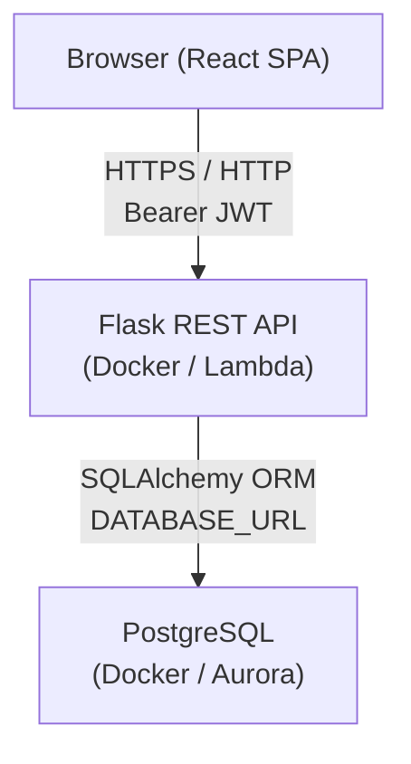
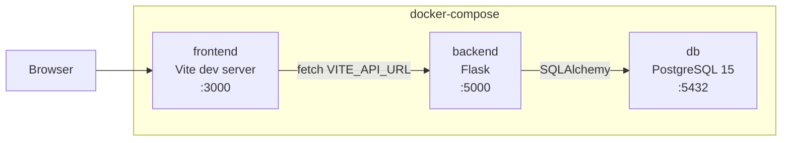
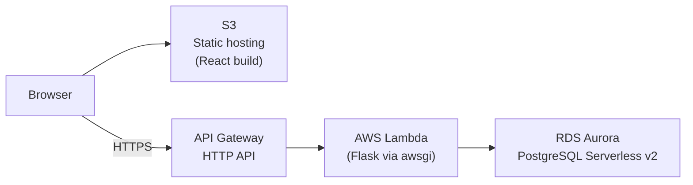
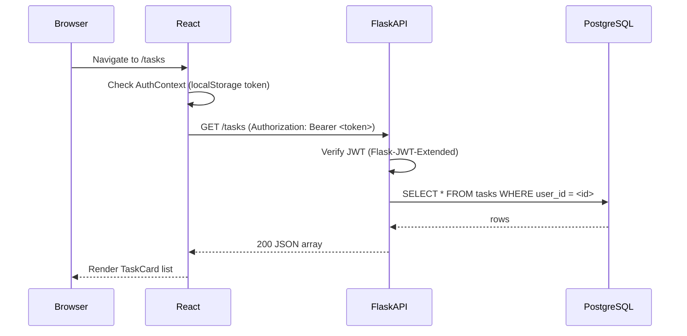
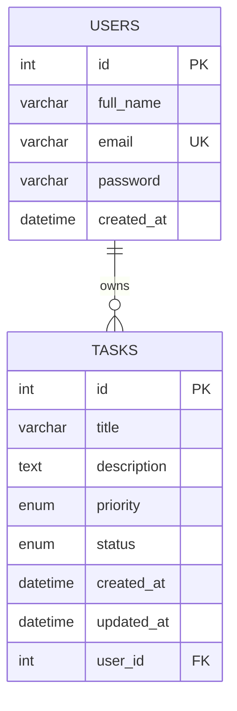

# Design Document — TaskFlow Application

## Overview

TaskFlow is a full-stack personal task management application. Users register and log in; thereafter they can create, view, edit, and delete their own tasks. No user can access another user's data.

The system is composed of three runtime layers:

- **Frontend** — React 18 + TypeScript SPA served by Vite, communicating over HTTP with the REST API.
- **Backend** — Python 3.11 Flask REST API, protected by JWT authentication, backed by PostgreSQL via SQLAlchemy ORM.
- **Database** — PostgreSQL 15 (Docker locally, Aurora PostgreSQL Serverless v2 in production).

All three services are orchestrated locally with Docker Compose. In production the backend runs as an AWS Lambda function behind API Gateway, and the frontend is hosted as a static site on S3.

### Key Design Goals

- **Strict data isolation**: a user's tasks are never visible to any other user.
- **Stateless authentication**: JWTs carry all session state; no server-side session storage.
- **Simple schema initialisation**: `db.create_all()` on startup — no migration tooling.
- **Reproducible local dev**: a single `docker compose up` brings the full stack online.

---

## Architecture

### System Context



### Local Development Architecture



### Production Architecture



### Request Lifecycle



---

## Components and Interfaces

### Backend Components

#### App Factory (`backend/app.py`)

```python
def create_app(config=None) -> Flask
```

- Initialises Flask, SQLAlchemy, JWTManager, CORS, and all route blueprints.
- Reads config from `backend/config.py` and the `.env` file.
- Calls `db.create_all()` inside application context on startup.
- Registers a `GET /health` route that returns `{"status": "ok"}` with HTTP 200.

#### Configuration (`backend/config.py`)

| Variable | Source | Purpose |
|---|---|---|
| `DATABASE_URL` | env | SQLAlchemy connection string |
| `JWT_SECRET_KEY` | env | JWT signing secret |
| `FLASK_ENV` | env | development / production |

On startup, the app validates that `DATABASE_URL` and `JWT_SECRET_KEY` are present and exits with a logged error message if either is missing.

#### Auth Blueprint (`backend/routes/auth.py`)

| Method | Path | Auth | Description |
|---|---|---|---|
| POST | `/auth/register` | None | Register new user |
| POST | `/auth/login` | None | Authenticate, receive tokens |

#### Tasks Blueprint (`backend/routes/tasks.py`)

| Method | Path | Auth | Description |
|---|---|---|---|
| GET | `/tasks` | JWT | List authenticated user's tasks |
| POST | `/tasks` | JWT | Create a new task |
| PUT | `/tasks/<id>` | JWT | Update a task (owner only) |
| DELETE | `/tasks/<id>` | JWT | Delete a task (owner only) |

#### Health Blueprint (`backend/routes/health.py`)

| Method | Path | Auth | Description |
|---|---|---|---|
| GET | `/health` | None | Liveness check |

#### Lambda Entry Point (`backend/wsgi.py`)

```python
import awsgi
from app import create_app

app = create_app()

def handler(event, context):
    return awsgi.response(app, event, context)
```

---

### Frontend Components

#### Page Components (`frontend/src/pages/`)

| Component | Route | Auth Required |
|---|---|---|
| `RegisterPage.tsx` | `/register` | No |
| `LoginPage.tsx` | `/login` | No |
| `TasksPage.tsx` | `/tasks` | Yes |
| `CreateTaskPage.tsx` | `/tasks/new` | Yes |
| `EditTaskPage.tsx` | `/tasks/:id/edit` | Yes |

#### Shared Components (`frontend/src/components/`)

| Component | Purpose |
|---|---|
| `Button.tsx` | Reusable button with Primary/Secondary/Outline/Ghost variants |
| `Input.tsx` | Controlled text input with error state |
| `Select.tsx` | Controlled select with error state |
| `Textarea.tsx` | Controlled textarea with error state |
| `Card.tsx` | Surface container with shadow |
| `TaskCard.tsx` | Displays a single task (title, description, priority badge, status badge, edit/delete actions) |
| `ErrorBanner.tsx` | Dismissible top-of-page error banner for 401/403/404/500 |
| `ProtectedRoute.tsx` | Wrapper that redirects unauthenticated users to `/login` |
| `ConfirmDialog.tsx` | Modal confirmation prompt (used before task deletion) |

#### Auth Context (`frontend/src/context/AuthContext.tsx`)

Provides `AuthContextType` to the whole component tree via React Context:

```ts
interface AuthContextType {
  token: string | null;
  user: User | null;
  login: (token: string, refreshToken: string, user: User) => void;
  logout: () => void;
}
```

- `login` stores `access_token` and `refresh_token` in `localStorage` and updates context state.
- `logout` removes both tokens from `localStorage`, clears context state, and redirects to `/login`.
- On mount, reads existing tokens from `localStorage` to restore session.

#### API Modules (`frontend/src/api/`)

| File | Exports |
|---|---|
| `auth.ts` | `register(payload)`, `login(payload)` |
| `tasks.ts` | `getTasks(token)`, `createTask(token, payload)`, `updateTask(token, id, payload)`, `deleteTask(token, id)` |

All API functions use the native `fetch` API, set `Authorization: Bearer <token>` on protected calls, and return typed Promises. Network errors (no response) are caught and re-thrown as a typed `NetworkError`.

#### Routing (`frontend/src/App.tsx`)

```
/                 → redirect to /tasks
/register         → RegisterPage
/login            → LoginPage
/tasks            → ProtectedRoute → TasksPage
/tasks/new        → ProtectedRoute → CreateTaskPage
/tasks/:id/edit   → ProtectedRoute → EditTaskPage
```

---

## Data Models

### User Model (`backend/models/user.py`)

```python
class User(db.Model):
    __tablename__ = 'users'

    id         = db.Column(db.Integer, primary_key=True)
    full_name  = db.Column(db.String(255), nullable=False)
    email      = db.Column(db.String(254), unique=True, nullable=False, index=True)
    password   = db.Column(db.String(512), nullable=False)  # pbkdf2:sha256 hash
    created_at = db.Column(db.DateTime, default=datetime.utcnow, nullable=False)

    tasks = db.relationship('Task', backref='owner', lazy=True, cascade='all, delete-orphan')

    def set_password(self, plain_text: str) -> None: ...
    def check_password(self, plain_text: str) -> bool: ...
    def to_dict(self) -> dict: ...  # returns id, full_name, email, created_at
```

- `email` stored in lower-case; comparison is case-insensitive.
- `password` never returned in `to_dict()`.

### Task Model (`backend/models/task.py`)

```python
class Priority(enum.Enum):
    LOW    = 'LOW'
    MEDIUM = 'MEDIUM'
    HIGH   = 'HIGH'

class Status(enum.Enum):
    PENDING    = 'PENDING'
    INPROGRESS = 'INPROGRESS'
    COMPLETED  = 'COMPLETED'

class Task(db.Model):
    __tablename__ = 'tasks'

    id          = db.Column(db.Integer, primary_key=True)
    title       = db.Column(db.String(200), nullable=False)
    description = db.Column(db.String(1000), nullable=False)
    priority    = db.Column(db.Enum(Priority), nullable=False)
    status      = db.Column(db.Enum(Status), nullable=False, default=Status.PENDING)
    created_at  = db.Column(db.DateTime, default=datetime.utcnow, nullable=False)
    updated_at  = db.Column(db.DateTime, default=datetime.utcnow, onupdate=datetime.utcnow, nullable=False)
    user_id     = db.Column(db.Integer, db.ForeignKey('users.id'), nullable=False, index=True)

    def to_dict(self) -> dict: ...  # returns all fields, priority/status as string values
```

### TypeScript Types (`frontend/src/types/index.ts`)

```ts
export interface User {
  id: number;
  full_name: string;
  email: string;
  created_at: string;
}

export type Priority = 'LOW' | 'MEDIUM' | 'HIGH';
export type TaskStatus = 'PENDING' | 'INPROGRESS' | 'COMPLETED';

export interface Task {
  id: number;
  title: string;
  description: string;
  priority: Priority;
  status: TaskStatus;
  created_at: string;
  updated_at: string;
  user_id: number;
}

export interface AuthContextType {
  token: string | null;
  user: User | null;
  login: (token: string, refreshToken: string, user: User) => void;
  logout: () => void;
}

// API payload shapes
export interface RegisterPayload { full_name: string; email: string; password: string; }
export interface LoginPayload    { email: string; password: string; }
export interface TaskPayload     { title: string; description: string; priority: Priority; status: TaskStatus; }

// API response shapes
export interface AuthResponse    { access_token: string; refresh_token: string; user: User; }
export interface ApiError        { error: string; }
export interface FieldErrors     { [field: string]: string }
```

### Database Schema (ERD)



---

## Error Handling

### Backend Error Strategy

All error responses follow a consistent JSON envelope:

```json
{ "error": "Human-readable message" }
```

For field-level validation failures, the response is:

```json
{ "errors": { "fieldName": "message", "otherField": "message" } }
```

| Scenario | HTTP Status | Notes |
|---|---|---|
| Missing required fields | 400 | Field names identified |
| Invalid field format/length | 400 | Constraint stated in message |
| Invalid enum value | 400 | Valid values listed |
| Duplicate email on register | 409 | |
| Bad credentials on login | 401 | Generic message (no field specificity) |
| Missing Authorization header | 401 | |
| Invalid or tampered token | 401 | |
| Expired token | 401 | |
| Task not found | 404 | |
| Requesting another user's task | 403 | |
| Unhandled exception | 500 | Sanitised message; full traceback logged server-side |

A global error handler is registered in `create_app()` using `@app.errorhandler(Exception)` to ensure no stack trace leaks to clients.

Missing required environment variables (`DATABASE_URL`, `JWT_SECRET_KEY`) cause the app to log an error and call `sys.exit(1)` before the first request is served.

### Frontend Error Strategy

#### Form-level errors

- Field validation errors (HTTP 400 `errors` map) are displayed inline below each input field.
- When a field value changes, its individual error is cleared immediately (Requirement 9.4).
- If the API returns a top-level `error` string, it is shown as a form-level message.

#### Session errors (401)

- Any 401 response during an active session triggers `AuthContext.logout()`, which clears tokens and redirects to `/login`.

#### Dismissible error banner

- HTTP 401, 403, 404, and 500 responses outside of form submission contexts show an `ErrorBanner` fixed at the top of the page.
- The banner includes a close (×) button to dismiss.

#### Network errors

- All API modules wrap `fetch` in a try/catch. A thrown `TypeError` (no response) surfaces as a user-facing message: "Unable to connect. Please check your network and try again." with a retry button that re-submits the same data.

#### UI validation (pre-flight)

- Empty title or description on task creation/edit: the form is blocked from submitting and inline errors are shown without an API round-trip (Requirement 4.6).

---

## Testing Strategy

The project uses **unit tests only** — no property-based testing — as specified by the project's technology steering.

### Backend — pytest + pytest-flask

**Test environment**: in-memory SQLite (`SQLALCHEMY_DATABASE_URI = 'sqlite://'`). Tests are isolated per-function using a fresh database created and torn down in fixtures.

**Test files** (`backend/tests/`):

| File | Coverage |
|---|---|
| `test_models.py` | `User.set_password`, `User.check_password`, `User.to_dict`, `Task.to_dict`, enum values |
| `test_auth.py` | `POST /auth/register` — all 8 acceptance criteria scenarios; `POST /auth/login` — all 7 scenarios |
| `test_tasks.py` | `GET /tasks`, `POST /tasks`, `PUT /tasks/<id>`, `DELETE /tasks/<id>` — all acceptance criteria |
| `test_health.py` | `GET /health` returns 200 |

**Example test scenarios** (non-exhaustive):

- Register with valid data → 201 with user fields, no password in response.
- Register with duplicate email → 409.
- Register with password < 8 chars → 400.
- Login with correct credentials → 200 with tokens and user.
- Login with wrong password → 401 (generic message).
- GET /tasks with valid token → only the requester's tasks returned.
- GET /tasks with expired token → 401.
- PUT /tasks/:id owned by another user → 403.
- DELETE /tasks/:id not found → 404.
- POST /tasks with whitespace-only title → 400.

### Frontend — Vitest + @testing-library/react

**Test environment**: jsdom. `fetch` is mocked globally with `vi.stubGlobal('fetch', ...)` in each test file.

**Test files** (co-located with source):

| File | Coverage |
|---|---|
| `RegisterPage.test.tsx` | Form renders, submit calls `register`, displays API errors, shows field errors |
| `LoginPage.test.tsx` | Form renders, successful login stores tokens and redirects, 401 shows error |
| `TasksPage.test.tsx` | Lists tasks, empty state message, 401 redirects to login |
| `CreateTaskPage.test.tsx` | Form renders with defaults, client-side validation, successful submit |
| `EditTaskPage.test.tsx` | Pre-populates fields, saves changes, shows API errors |
| `TaskCard.test.tsx` | Renders all task fields, delete button triggers confirm dialog |
| `ConfirmDialog.test.tsx` | Renders, confirm/cancel callbacks fire |
| `ErrorBanner.test.tsx` | Renders message, dismiss button removes it |
| `ProtectedRoute.test.tsx` | Redirects when no token, renders children when token present |
| `auth.test.ts` | `register` and `login` — correct URL, method, body; network error handling |
| `tasks.test.ts` | `getTasks`, `createTask`, `updateTask`, `deleteTask` — correct headers, bodies, error handling |
| `AuthContext.test.tsx` | `login` sets localStorage and state; `logout` clears localStorage and state |

**Coverage targets**: every exported component function and every API module function must have at least one test exercising the happy path and one exercising an error path.

### Docker Compose Smoke Check

After `docker compose up`, a manual (or CI script) check:
- `GET http://localhost:5000/health` → 200.
- `GET http://localhost:3000` → non-error HTTP response.

---

## Design Decisions and Rationale

### No Alembic — `db.create_all()` only
The project is a workshop demo, not a long-running production system requiring incremental migrations. `db.create_all()` keeps the setup simple: spin up Docker, start Flask, database is ready. Alembic would add workflow complexity that isn't warranted here.

### JWT in localStorage
Accepted trade-off for a workshop project. `httpOnly` cookies would be more secure, but require CORS + cookie configuration that adds complexity. The requirements explicitly specify localStorage.

### `awsgi` over Mangum
Both adapt WSGI apps to Lambda, but the project steering explicitly mandates `awsgi`. The Lambda entry point is kept in `wsgi.py`, separate from the Flask app factory, making local development and testing unaffected by Lambda-specific code.

### CSS Modules over Tailwind
Keeps dependencies minimal and makes the design system explicit in code. Each component owns its styles without class-name conflicts, and the design tokens (colours, spacing, border-radius) are applied directly as CSS variables or inline values per the design system specification.

### Native fetch over Axios
Consistent with the steering requirement and reduces bundle size. Network error handling is implemented centrally in each API module rather than via Axios interceptors.

### Flask Blueprints
Auth and Tasks are separate blueprints registered in `create_app()`. This keeps route handlers focused, makes testing each blueprint in isolation straightforward, and allows URL prefixing (`/auth`, `/tasks`) cleanly.

### `updated_at` via SQLAlchemy `onupdate`
Using SQLAlchemy's `onupdate=datetime.utcnow` on the `updated_at` column ensures the timestamp is always refreshed on every ORM-level `UPDATE`, without requiring application code to set it manually.
