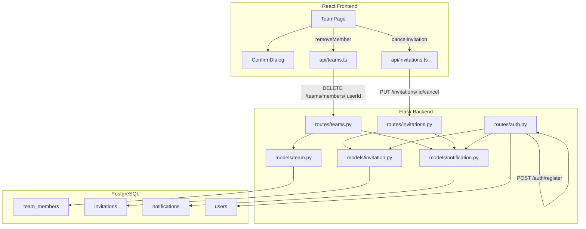

# Design Document: Team Management Enhancements

## Overview

This feature extends TaskFlow's team management with three backend capabilities and two frontend UI enhancements:

1. **Remove Team Member** — Allows team owners to remove members via a DELETE endpoint, with automatic notification to the removed user.
2. **Cancel Pending Invitation** — Allows inviters to cancel outstanding invitations via a PUT endpoint, marking associated notifications as read.
3. **Deliver Pending Invitations on Registration** — During user registration, the system auto-links any pending invitations addressed to the new user's email and creates notifications for each.
4. **Frontend Remove Member UI** — Adds owner-only remove controls with a confirmation dialog to the TeamPage.
5. **Frontend Cancel Invitation UI** — Adds cancel controls for pending invitations with a confirmation dialog and loading states.

All changes build on existing patterns: Flask blueprints, SQLAlchemy models, JWT authentication, the `ConfirmDialog` component, and the native fetch-based API layer.

## Architecture



## Components and Interfaces

### Backend API Endpoints

#### DELETE /teams/members/<user_id>

Removes a team member. Requires JWT. Only team owner can execute.

**Request:**
- URL param: `user_id` (integer) — the user to remove
- Header: `Authorization: Bearer <token>`

**Response (200):**
```json
{ "message": "Member removed successfully." }
```

**Error Responses:**
- 400: `{ "error": "Cannot remove the team owner." }`
- 403: `{ "error": "Only the team owner can remove members." }`
- 404: `{ "error": "Member not found in this team." }`
- 500: `{ "error": "An unexpected error occurred. Please try again later." }`

**Side effects:** Creates a `Notification` with type `"team_removal"` for the removed user.

#### PUT /invitations/<invitation_id>/cancel

Cancels a pending invitation. Requires JWT. Only the original inviter can execute.

**Request:**
- URL param: `invitation_id` (integer)
- Header: `Authorization: Bearer <token>`

**Response (200):**
```json
{ "id": 5, "status": "cancelled" }
```

**Error Responses:**
- 400: `{ "error": "Only pending invitations can be cancelled." }`
- 403: `{ "error": "You are not the inviter for this invitation." }`
- 404: `{ "error": "Invitation not found." }`
- 500: `{ "error": "An unexpected error occurred. Please try again later." }`

**Side effects:** Marks the related notification (if any) as read.

#### POST /auth/register (Enhanced)

Enhanced to auto-link pending invitations after user creation.

**Additional behaviour after user is created:**
1. Query `invitations` where `LOWER(invitee_email) = LOWER(new_user.email)` AND `status = 'pending'`
2. For each match: set `invitee_id = new_user.id`
3. For each match: create a `Notification` with `type="team_invitation"`, `invitation_id=invitation.id`
4. All within the same transaction as user creation

### Frontend Components

#### TeamPage Enhancements

**Remove Member Controls:**
- Render a remove button (icon or text) next to each member with role `"member"` — only when the current user is the team owner.
- On click: open `ConfirmDialog` with message identifying the member by name.
- On confirm: disable button, call `removeMember()`, on success remove member from local state.
- On failure: show dismissible error banner.

**Cancel Invitation Controls:**
- Render a cancel button next to each pending invitation.
- On click: open `ConfirmDialog` with message identifying the invitee email.
- On confirm: disable cancel button for that invitation, call `cancelInvitation()`, on success remove from local state.
- On failure: re-enable button, show dismissible error message.
- While in-flight: button stays disabled to prevent duplicate requests.

#### API Client Functions

**`api/teams.ts` — new export:**
```typescript
export async function removeMember(token: string, userId: number): Promise<{ message: string }>
```

**`api/invitations.ts` — new export:**
```typescript
export async function cancelInvitation(token: string, invitationId: number): Promise<{ id: number; status: string }>
```

### Model Changes

#### InvitationStatus Enum (Updated)

Add `CANCELLED = "cancelled"` to the existing `InvitationStatus` enum in `models/invitation.py`.

#### No New Models Required

Existing `TeamMember`, `Invitation`, and `Notification` models support all operations without schema changes beyond the enum addition.

## Data Models

### Existing Tables Used

| Table | Key Columns | Role in Feature |
|-------|-------------|-----------------|
| `team_members` | id, team_id, user_id, role | Deleted record on remove |
| `invitations` | id, team_id, inviter_id, invitee_id, invitee_email, status | Status updated to "cancelled"; invitee_id linked on registration |
| `notifications` | id, user_id, type, message, invitation_id, is_read | Created on removal; marked read on cancel; created on registration |
| `users` | id, full_name, email | Source of identity and email matching |

### InvitationStatus Values

```
PENDING → ACCEPTED
PENDING → DECLINED
PENDING → CANCELLED  ← NEW
```

### Notification Types

| Type | Trigger | Message Template |
|------|---------|-----------------|
| `team_invitation` | Invite sent / Registration links invitation | `"{inviter_name} invited you to join their team."` |
| `team_removal` | Member removed from team | `"You have been removed from {team_name}."` |

## Correctness Properties

*A property is a characteristic or behavior that should hold true across all valid executions of a system — essentially, a formal statement about what the system should do. Properties serve as the bridge between human-readable specifications and machine-verifiable correctness guarantees.*

### Property 1: Removal deletes membership

*For any* team with at least one non-owner member, when the team owner issues a remove request for that member, the member should no longer exist in the team's `team_members` records.

**Validates: Requirements 1.1**

### Property 2: Non-owner cannot remove members

*For any* user who is not the team owner, attempting to remove any member from the team should be rejected with a 403 status, and the team's membership should remain unchanged.

**Validates: Requirements 1.3**

### Property 3: Removal notification created

*For any* successful member removal, a notification with type `"team_removal"` should exist for the removed user, referencing the correct team.

**Validates: Requirements 1.6**

### Property 4: Cancel changes status to cancelled

*For any* pending invitation, when the original inviter cancels it, the invitation's status should be `"cancelled"` and no longer `"pending"`.

**Validates: Requirements 2.1**

### Property 5: Non-inviter cannot cancel

*For any* user who is not the original inviter, attempting to cancel an invitation should be rejected with a 403 status, and the invitation's status should remain unchanged.

**Validates: Requirements 2.3**

### Property 6: Only pending invitations can be cancelled

*For any* invitation whose status is not `"pending"` (i.e., accepted, declined, or already cancelled), attempting to cancel should return a 400 status, and the invitation's status should remain unchanged.

**Validates: Requirements 2.5**

### Property 7: Cancel marks notification as read

*For any* cancelled invitation that has an associated notification record, that notification's `is_read` field should be `True` after the cancellation completes.

**Validates: Requirements 2.6**

### Property 8: Registration links pending invitations case-insensitively

*For any* newly registered user with email `E`, all invitations where `LOWER(invitee_email) == LOWER(E)` and `status == "pending"` should have their `invitee_id` set to the new user's ID after registration.

**Validates: Requirements 3.1, 3.2**

### Property 9: Registration creates one notification per matched invitation

*For any* set of N pending invitations matching a newly registered user's email, exactly N notifications of type `"team_invitation"` should be created for the new user, each linked to a distinct invitation via `invitation_id`.

**Validates: Requirements 3.3**

### Property 10: Registration transaction atomicity

*For any* registration where pending invitation processing or notification creation fails, neither the user record nor any invitation updates nor any notifications should persist in the database.

**Validates: Requirements 3.5, 3.6**

### Property 11: Remove action visibility determined by owner role

*For any* team members list rendered in the frontend, remove action controls are visible next to non-owner members if and only if the current authenticated user is the team owner.

**Validates: Requirements 4.1, 4.5**

## Error Handling

### Backend Error Strategy

| Scenario | HTTP Code | Response | Recovery |
|----------|-----------|----------|----------|
| Non-owner attempts removal | 403 | `{"error": "Only the team owner can remove members."}` | Frontend hides button for non-owners |
| Owner tries to self-remove | 400 | `{"error": "Cannot remove the team owner."}` | Frontend never renders remove for owner |
| Target not a member | 404 | `{"error": "Member not found in this team."}` | Frontend removes stale entry |
| Non-inviter cancels | 403 | `{"error": "You are not the inviter for this invitation."}` | — |
| Invitation not pending | 400 | `{"error": "Only pending invitations can be cancelled."}` | Frontend removes stale entry |
| Invitation not found | 404 | `{"error": "Invitation not found."}` | Frontend removes stale entry |
| Database error (any endpoint) | 500 | `{"error": "An unexpected error occurred. Please try again later."}` | Transaction rolled back |

### Backend Transaction Safety

- All mutating operations use `try/except` with `db.session.rollback()` on failure.
- The registration endpoint wraps user creation + invitation linking + notification creation in a single transaction.
- On rollback, the response returns 500 with a generic error message.

### Frontend Error Strategy

- **Dismissible error banners**: Displayed below the section header when API calls fail.
- **Optimistic removal**: Members/invitations are only removed from local state after a successful API response (no optimistic UI).
- **Button disable during flight**: Prevents duplicate requests and indicates loading.
- **State preservation on error**: The list remains unchanged if the API call fails, so users can retry.

## Testing Strategy

### Backend Testing (pytest)

**Unit tests** for each endpoint covering:
- Success path (valid owner removes member, inviter cancels invitation, registration links invitations)
- Authorization failures (non-owner, non-inviter)
- Validation failures (self-remove, non-pending status, missing record)
- Database error rollback (mocked `db.session.commit` raising an exception)
- Edge cases (user has no team, invitation already cancelled)

**Property-based tests** (using `hypothesis`) for:
- Removal authorization invariant (Property 2)
- Cancel precondition invariant (Property 6)
- Registration email matching (Property 8)
- Registration notification count (Property 9)

**Property test configuration:**
- Library: `hypothesis` (Python)
- Minimum 100 examples per property
- Each test tagged with: `# Feature: team-management-enhancements, Property N: <property text>`

### Frontend Testing (Vitest + Testing Library)

**Unit tests** for each UI behavior:
- Remove button renders only for owner viewing non-owner members
- Remove button hidden for non-owner users
- ConfirmDialog appears on remove click with correct member name
- Member removed from list on successful API call
- Error banner appears on failed removal
- Cancel button renders for each pending invitation
- ConfirmDialog appears on cancel click with correct email
- Invitation removed from list on successful cancel
- Error message on failed cancel
- Cancel button disabled while request in-flight

**API function tests:**
- `removeMember`: success path (200), error path (non-ok response throws)
- `cancelInvitation`: success path (200), error path (non-ok response throws)

**Test configuration:**
- Framework: Vitest with jsdom environment
- UI testing: @testing-library/react + @testing-library/user-event
- Mock: `vi.stubGlobal('fetch', ...)` for all API calls
- No property-based tests on frontend (per project conventions)
