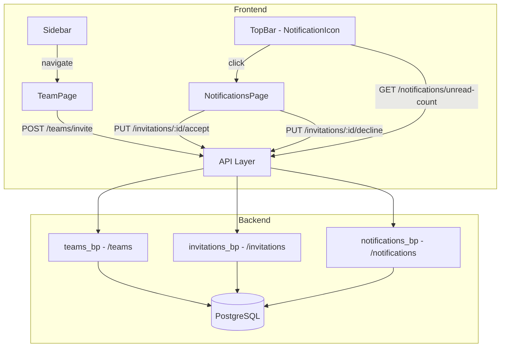
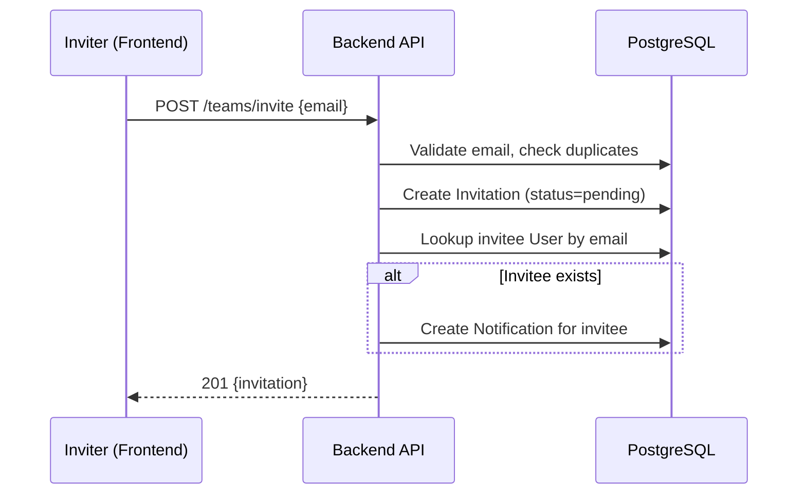
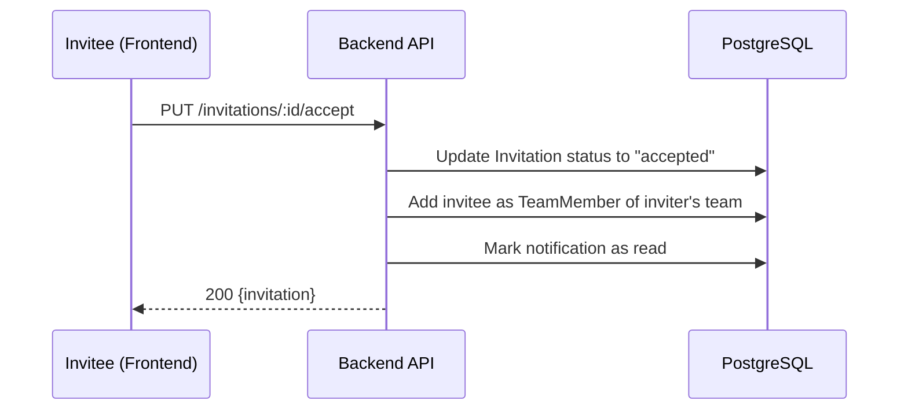
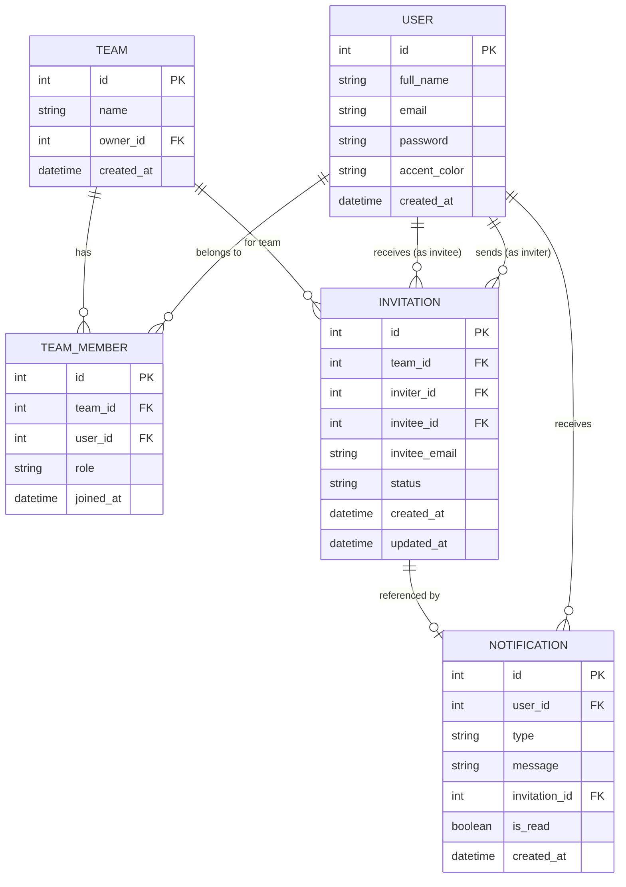

# Design Document: Team Notifications

## Overview

This design introduces team collaboration and in-app notification capabilities to TaskFlow. The feature adds four new database models (Team, TeamMember, Invitation, Notification), three new API blueprint route groups, two new frontend pages, and a notification icon in the existing TopBar component.

The architecture follows the established patterns: Flask blueprints with JWT-protected endpoints on the backend, and React pages with native fetch API calls on the frontend. The feature integrates into the existing DashboardLayout with sidebar navigation and uses CSS Modules for styling consistent with the design system.

### Key Design Decisions

1. **Implicit team creation**: Each user gets a team created automatically on registration (or lazily on first invite). This avoids a separate "create team" flow and keeps the UX simple.
2. **Email-based invitations**: Invitations target an email address. If the invitee is already registered, a notification is created immediately. If not, the invitation remains pending until they register.
3. **Polling for notifications**: The frontend polls the unread notification count on a short interval (30 seconds) rather than using WebSockets. This keeps infrastructure simple (Lambda-compatible) and avoids adding new dependencies.
4. **Single team per user**: For simplicity, each user belongs to at most one team at a time. Accepting an invitation moves the user to the inviter's team.

## Architecture



### Request Flow: Send Invitation



### Request Flow: Accept Invitation



## Components and Interfaces

### Backend Components

#### 1. Models (`backend/models/`)

| Model | File | Purpose |
|-------|------|---------|
| Team | `team.py` | Represents a team group |
| TeamMember | `team.py` | Join table: User ↔ Team with role |
| Invitation | `invitation.py` | Tracks pending/accepted/declined invites |
| Notification | `notification.py` | In-app notification records |

#### 2. Route Blueprints (`backend/routes/`)

| Blueprint | Prefix | File | Endpoints |
|-----------|--------|------|-----------|
| teams_bp | `/teams` | `teams.py` | GET /teams/members, POST /teams/invite |
| invitations_bp | `/invitations` | `invitations.py` | PUT /invitations/:id/accept, PUT /invitations/:id/decline |
| notifications_bp | `/notifications` | `notifications.py` | GET /notifications, GET /notifications/unread-count |

### Frontend Components

#### 1. API Modules (`frontend/src/api/`)

| Module | File | Functions |
|--------|------|-----------|
| Teams API | `teams.ts` | `getTeamMembers()`, `sendInvite()` |
| Invitations API | `invitations.ts` | `acceptInvitation()`, `declineInvitation()` |
| Notifications API | `notifications.ts` | `getNotifications()`, `getUnreadCount()` |

#### 2. Pages (`frontend/src/pages/`)

| Page | File | Route |
|------|------|-------|
| TeamPage | `TeamPage.tsx` | `/team` |
| NotificationsPage | `NotificationsPage.tsx` | `/notifications` |

#### 3. Components (`frontend/src/components/`)

| Component | File | Location |
|-----------|------|----------|
| NotificationIcon | `NotificationIcon.tsx` | Rendered inside TopBar |

### API Endpoint Specifications

#### Teams Blueprint

**GET /teams/members**
- Auth: JWT required
- Response 200:
```json
{
  "members": [
    { "id": 1, "full_name": "Jane Doe", "email": "jane@example.com", "role": "owner", "joined_at": "2024-01-01T00:00:00" }
  ],
  "pending_invitations": [
    { "id": 1, "email": "bob@example.com", "status": "pending", "created_at": "2024-01-02T00:00:00" }
  ]
}
```

**POST /teams/invite**
- Auth: JWT required
- Body: `{ "email": "bob@example.com" }`
- Response 201: `{ "id": 1, "email": "bob@example.com", "status": "pending", "created_at": "..." }`
- Error 400: `{ "error": "Email is required." }` / `{ "error": "Invalid email format." }` / `{ "error": "Cannot invite yourself." }`
- Error 409: `{ "error": "An invitation is already pending for this email." }`

#### Invitations Blueprint

**PUT /invitations/:id/accept**
- Auth: JWT required (must be the invitee)
- Response 200: `{ "id": 1, "status": "accepted", "team_id": 1 }`
- Error 403: `{ "error": "You are not the invitee for this invitation." }`
- Error 404: `{ "error": "Invitation not found." }`

**PUT /invitations/:id/decline**
- Auth: JWT required (must be the invitee)
- Response 200: `{ "id": 1, "status": "declined" }`
- Error 403: `{ "error": "You are not the invitee for this invitation." }`
- Error 404: `{ "error": "Invitation not found." }`

#### Notifications Blueprint

**GET /notifications**
- Auth: JWT required
- Response 200:
```json
{
  "notifications": [
    {
      "id": 1,
      "type": "team_invitation",
      "message": "Jane Doe invited you to join their team.",
      "inviter_name": "Jane Doe",
      "invitation_id": 5,
      "invitation_status": "pending",
      "is_read": false,
      "created_at": "2024-01-02T00:00:00"
    }
  ]
}
```

**GET /notifications/unread-count**
- Auth: JWT required
- Response 200: `{ "count": 3 }`

## Data Models

### Entity Relationship Diagram



### Model Definitions

#### Team

```python
class Team(db.Model):
    __tablename__ = "teams"

    id = db.Column(db.Integer, primary_key=True)
    name = db.Column(db.String(255), nullable=False)
    owner_id = db.Column(db.Integer, db.ForeignKey("users.id"), nullable=False, index=True)
    created_at = db.Column(db.DateTime, default=datetime.utcnow, nullable=False)

    owner = db.relationship("User", backref="owned_teams", foreign_keys=[owner_id])
    members = db.relationship("TeamMember", backref="team", lazy=True, cascade="all, delete-orphan")
```

#### TeamMember

```python
class TeamMember(db.Model):
    __tablename__ = "team_members"

    id = db.Column(db.Integer, primary_key=True)
    team_id = db.Column(db.Integer, db.ForeignKey("teams.id"), nullable=False, index=True)
    user_id = db.Column(db.Integer, db.ForeignKey("users.id"), nullable=False, index=True)
    role = db.Column(db.String(20), nullable=False, default="member")  # "owner" or "member"
    joined_at = db.Column(db.DateTime, default=datetime.utcnow, nullable=False)

    user = db.relationship("User", backref="team_memberships")

    __table_args__ = (db.UniqueConstraint("team_id", "user_id", name="uq_team_user"),)
```

#### Invitation

```python
class InvitationStatus(enum.Enum):
    PENDING = "pending"
    ACCEPTED = "accepted"
    DECLINED = "declined"

class Invitation(db.Model):
    __tablename__ = "invitations"

    id = db.Column(db.Integer, primary_key=True)
    team_id = db.Column(db.Integer, db.ForeignKey("teams.id"), nullable=False, index=True)
    inviter_id = db.Column(db.Integer, db.ForeignKey("users.id"), nullable=False, index=True)
    invitee_id = db.Column(db.Integer, db.ForeignKey("users.id"), nullable=True, index=True)
    invitee_email = db.Column(db.String(254), nullable=False)
    status = db.Column(db.Enum(InvitationStatus), nullable=False, default=InvitationStatus.PENDING)
    created_at = db.Column(db.DateTime, default=datetime.utcnow, nullable=False)
    updated_at = db.Column(db.DateTime, default=datetime.utcnow, onupdate=datetime.utcnow, nullable=False)

    team = db.relationship("Team", backref="invitations")
    inviter = db.relationship("User", foreign_keys=[inviter_id], backref="sent_invitations")
    invitee = db.relationship("User", foreign_keys=[invitee_id], backref="received_invitations")
```

#### Notification

```python
class Notification(db.Model):
    __tablename__ = "notifications"

    id = db.Column(db.Integer, primary_key=True)
    user_id = db.Column(db.Integer, db.ForeignKey("users.id"), nullable=False, index=True)
    type = db.Column(db.String(50), nullable=False, default="team_invitation")
    message = db.Column(db.String(500), nullable=False)
    invitation_id = db.Column(db.Integer, db.ForeignKey("invitations.id"), nullable=True)
    is_read = db.Column(db.Boolean, nullable=False, default=False)
    created_at = db.Column(db.DateTime, default=datetime.utcnow, nullable=False)

    user = db.relationship("User", backref="notifications")
    invitation = db.relationship("Invitation", backref="notification")
```

### Frontend TypeScript Types

```typescript
// New types to add to frontend/src/types/index.ts

export type InvitationStatus = 'pending' | 'accepted' | 'declined';

export interface TeamMember {
  id: number;
  full_name: string;
  email: string;
  role: 'owner' | 'member';
  joined_at: string;
}

export interface PendingInvitation {
  id: number;
  email: string;
  status: InvitationStatus;
  created_at: string;
}

export interface TeamMembersResponse {
  members: TeamMember[];
  pending_invitations: PendingInvitation[];
}

export interface Notification {
  id: number;
  type: string;
  message: string;
  inviter_name: string;
  invitation_id: number;
  invitation_status: InvitationStatus;
  is_read: boolean;
  created_at: string;
}

export interface UnreadCountResponse {
  count: number;
}
```

## Correctness Properties

Since the workspace rules mandate unit tests only (no property-based tests), correctness is enforced through the following invariants verified in unit tests:

### Property 1: Invitation Uniqueness

A user cannot have more than one pending invitation to the same team for the same email address. If a pending invitation already exists for a given (team_id, invitee_email) pair, the system SHALL return HTTP 409.

**Validates: Requirements 2.6**

### Property 2: Self-Invite Prevention

The inviter and invitee must be different users. If the invitation email matches the authenticated user's email, the system SHALL return HTTP 400.

**Validates: Requirements 2.7**

### Property 3: Authorization on Accept/Decline

Only the invitee (matched by invitee_id) can accept or decline an invitation. If a different user attempts the action, the system SHALL return HTTP 403.

**Validates: Requirements 6.1**

### Property 4: Invitation Status State Machine

An invitation can only transition from PENDING → ACCEPTED or PENDING → DECLINED. Attempting to accept or decline a non-pending invitation SHALL return HTTP 400.

**Validates: Requirements 6.2, 6.3**

### Property 5: Team Membership on Accept

When an invitation is accepted, a TeamMember record MUST be created linking the invitee to the inviter's team. The membership is verifiable via GET /teams/members.

**Validates: Requirements 6.2, 7.3**

### Property 6: Notification Creation on Invite

When an invitation is created for a registered user (email matches an existing account), a Notification record MUST be created for the invitee with type "team_invitation".

**Validates: Requirements 3.1, 3.2**

### Property 7: Unread Count Accuracy

The unread notification count returned by GET /notifications/unread-count MUST equal the count of Notification records where is_read = False for the authenticated user.

**Validates: Requirements 3.3, 4.2**

## Error Handling

### Backend Error Handling

| Scenario | HTTP Code | Response |
|----------|-----------|----------|
| Missing email in invitation request | 400 | `{ "error": "Email is required." }` |
| Invalid email format | 400 | `{ "error": "Invalid email format." }` |
| Self-invitation attempt | 400 | `{ "error": "Cannot invite yourself." }` |
| Duplicate pending invitation | 409 | `{ "error": "An invitation is already pending for this email." }` |
| Invitation not found | 404 | `{ "error": "Invitation not found." }` |
| Not the invitee (accept/decline) | 403 | `{ "error": "You are not the invitee for this invitation." }` |
| Invitation already resolved | 400 | `{ "error": "Invitation is no longer pending." }` |
| Invitee email not registered | 404 | `{ "error": "No user found with this email address." }` |
| Database error | 500 | `{ "error": "An unexpected error occurred." }` |

### Frontend Error Handling

- All API functions check `response.ok` before parsing JSON.
- Non-ok responses throw an `Error` with the server's `error` message.
- Components catch errors and display them using the existing `ErrorBanner` component.
- Network failures (`TypeError` from fetch) display "Unable to connect to server."
- Loading states disable form buttons to prevent duplicate submissions.

## Testing Strategy

### Backend Tests

Test files: `backend/tests/test_teams.py`, `backend/tests/test_invitations.py`, `backend/tests/test_notifications.py`

- Use `pytest` with `pytest-flask` and in-memory SQLite.
- Test each endpoint for success (200/201) and every error path (400/403/404/409/500).
- Validate model `to_dict()` serialization.
- Create test fixtures for users, teams, and invitations in `conftest.py`.

### Frontend Tests

Test files colocated with source: `TeamPage.test.tsx`, `NotificationsPage.test.tsx`, `NotificationIcon.test.tsx`, `api/teams.test.ts`, `api/invitations.test.ts`, `api/notifications.test.ts`

- Use `vitest` with `@testing-library/react` and `jsdom`.
- Mock `fetch` globally with `vi.stubGlobal`.
- Test components in loading, success, empty, and error states.
- Test user interactions: form submission, accept/decline button clicks.
- Test API modules: verify correct URL, method, headers, and error throwing.


## Error Handling

### Backend Error Strategy

All error responses follow the established pattern in the codebase:

| Scenario | HTTP Code | Response Shape |
|----------|-----------|----------------|
| Missing required field | 400 | `{ "error": "Email is required." }` |
| Invalid email format | 400 | `{ "error": "Invalid email format." }` |
| Self-invitation | 400 | `{ "error": "Cannot invite yourself." }` |
| Duplicate pending invitation | 409 | `{ "error": "An invitation is already pending for this email." }` |
| Not the invitee | 403 | `{ "error": "You are not the invitee for this invitation." }` |
| Invitation not found | 404 | `{ "error": "Invitation not found." }` |
| Invitation not pending | 400 | `{ "error": "Invitation is no longer pending." }` |
| Database error | 500 | `{ "error": "An unexpected error occurred. Please try again later." }` |

### Backend Error Handling Pattern

```python
# Every route wraps DB operations in try/except
try:
    db.session.add(invitation)
    db.session.commit()
except Exception:
    db.session.rollback()
    logger.exception("Database error while creating invitation")
    return jsonify({"error": "An unexpected error occurred. Please try again later."}), 500
```

### Frontend Error Handling

The frontend follows the existing `NetworkError` pattern from `frontend/src/types/index.ts`:

1. **Network errors** (fetch throws TypeError): Caught and wrapped in `NetworkError` with user-friendly message.
2. **API errors** (non-ok response): Parsed from JSON response body and displayed in error banners.
3. **Loading states**: Every data-fetching page shows a loading indicator during fetch.
4. **Error display**: Uses the existing `ErrorBanner` component pattern for error messages.

### State Transition Validation

Invitation status transitions are validated server-side:
- `pending` → `accepted` (via accept endpoint)
- `pending` → `declined` (via decline endpoint)
- Any other transition returns 400 "Invitation is no longer pending."

## Testing Strategy

### Why Property-Based Testing Is Not Used

This project's workspace rules explicitly prohibit property-based testing. All testing uses example-based unit tests only. This is appropriate because:
- The steering rules state "Do NOT write property-based tests — unit tests only" for both frontend and backend
- The project uses pytest for backend and vitest for frontend with example-based tests

### Backend Tests (`backend/tests/`)

| Test File | Coverage |
|-----------|----------|
| `test_teams.py` | GET /teams/members, POST /teams/invite with all validation cases |
| `test_invitations.py` | PUT /invitations/:id/accept, PUT /invitations/:id/decline with auth checks |
| `test_notifications.py` | GET /notifications, GET /notifications/unread-count |
| `test_team_models.py` | Team, TeamMember, Invitation, Notification model `to_dict()` methods |

#### Backend Test Cases

**Teams routes:**
- Returns empty members list for new user
- Returns confirmed members with name and email
- Returns pending invitations separately
- Creates invitation for valid email (201)
- Rejects empty email (400)
- Rejects invalid email format (400)
- Rejects self-invitation (400)
- Rejects duplicate pending invitation (409)
- Handles database errors gracefully (500)

**Invitations routes:**
- Accept updates status and creates team membership (200)
- Decline updates status (200)
- Rejects accept/decline by non-invitee (403)
- Returns 404 for non-existent invitation
- Rejects accept/decline for non-pending invitation (400)

**Notifications routes:**
- Returns notifications ordered newest to oldest
- Returns correct unread count
- Returns empty list when no notifications exist
- Includes invitation status in notification response

### Frontend Tests (`frontend/src/`)

| Test File | Coverage |
|-----------|----------|
| `api/teams.test.ts` | `getTeamMembers()`, `sendInvite()` success and error paths |
| `api/invitations.test.ts` | `acceptInvitation()`, `declineInvitation()` success and error paths |
| `api/notifications.test.ts` | `getNotifications()`, `getUnreadCount()` success and error paths |
| `components/NotificationIcon.test.tsx` | Badge display, click navigation, zero-count state |
| `pages/TeamPage.test.tsx` | Renders members, pending invitations, loading state, error state, invite form |
| `pages/NotificationsPage.test.tsx` | Renders notifications, accept/decline actions, empty state, loading state |

#### Frontend Test Pattern

```typescript
// Example: api/teams.test.ts
describe('sendInvite', () => {
  it('returns invitation on success', async () => {
    vi.stubGlobal('fetch', vi.fn().mockResolvedValue({
      ok: true,
      json: async () => ({ id: 1, email: 'bob@example.com', status: 'pending' }),
    }));
    const result = await sendInvite('token', 'bob@example.com');
    expect(result.status).toBe('pending');
  });

  it('throws on non-ok response', async () => {
    vi.stubGlobal('fetch', vi.fn().mockResolvedValue({
      ok: false,
      json: async () => ({ error: 'Cannot invite yourself.' }),
    }));
    await expect(sendInvite('token', 'self@example.com')).rejects.toEqual(
      expect.objectContaining({ error: 'Cannot invite yourself.' })
    );
  });
});
```

### Test Infrastructure

- **Backend**: pytest with in-memory SQLite, fixtures in `conftest.py` for app, client, and authenticated user
- **Frontend**: vitest with jsdom, `vi.stubGlobal('fetch', ...)` for API mocking
- **Run backend tests**: `pytest backend/tests/ -v`
- **Run frontend tests**: `npm run test` (vitest in run mode)
